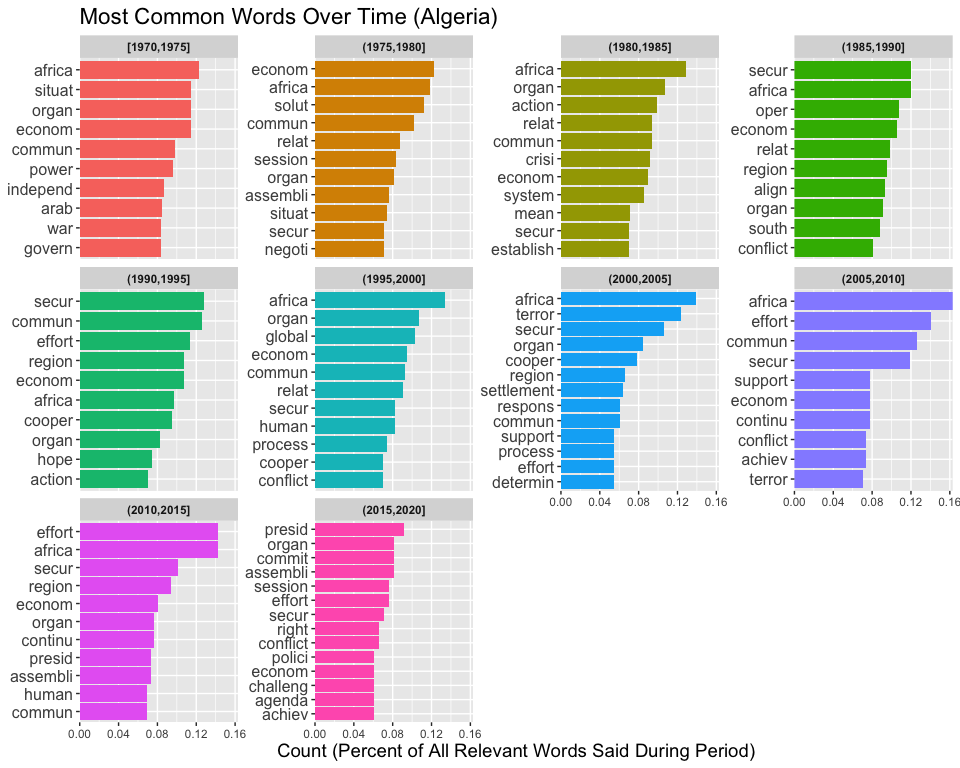

Mapping the Politics of the New Global South, Progress Update
================
Neeraj Sharma
7/31/2019

# Introduction

I am working for Professor Mark Bradley in the History Department at the
University of Chicago this summer on his research project, Mapping the
Politics of the New Global South.

# Setup

Prior to performing analysis on the data collected, it is necessary to
prep the work environment so it contains all the packages necessary for
exploration.

## Load Packages

``` r
# Relevant to data importation, structuring and visualization
library(tidyverse)
library(knitr)
library(readr)
library(here)

# Relevant to data formatting
library(lubridate)
library(countrycode)

# Relevant to text analysis
library(tidytext)
library(stringr)
library(SnowballC)
library(textclean)
```

## Import datasets

These datasets were produced through the corpus\_maker.R script. The
original source files are from
Mikhaylov.

``` r
unigrams_corpus_1970on <- read_tsv(here::here("Data", "unigrams_mikhaylov_project.tsv")) %>%
  select(Session, Year, Country, word, word_stem)

bigrams_corpus_1970on <- read_tsv(here::here("Data", "bigrams_mikhaylov_project.tsv")) %>%
  select(Session, Year, Country, first_word_stem, second_word_stem, word_stem)
```

## Glimpse at the content of the datasets

Unigrams

``` r
kable(unigrams_corpus_1970on %>% slice(1:10))
```

| Session | Year | Country | word            | word\_stem |
| ------: | ---: | :------ | :-------------- | :--------- |
|      25 | 1970 | Albania | convey          | convei     |
|      25 | 1970 | Albania | president       | presid     |
|      25 | 1970 | Albania | congratulations | congratul  |
|      25 | 1970 | Albania | albanian        | albanian   |
|      25 | 1970 | Albania | delegation      | deleg      |
|      25 | 1970 | Albania | election        | elect      |
|      25 | 1970 | Albania | presidency      | presid     |
|      25 | 1970 | Albania | twenty          | twenti     |
|      25 | 1970 | Albania | session         | session    |
|      25 | 1970 | Albania | assembly        | assembli   |

Bigrams

``` r
kable(bigrams_corpus_1970on %>% filter(Session == 25) %>% slice(1:10))
```

| Session | Year | Country | first\_word\_stem | second\_word\_stem | word\_stem         |
| ------: | ---: | :------ | :---------------- | :----------------- | :----------------- |
|      25 | 1970 | Albania | albanian          | deleg              | albanian deleg     |
|      25 | 1970 | Albania | unit              | nation             | unit nation        |
|      25 | 1970 | Albania | peac              | love               | peac love          |
|      25 | 1970 | Albania | satisfactori      | activ              | satisfactori activ |
|      25 | 1970 | Albania | unit              | nation             | unit nation        |
|      25 | 1970 | Albania | albanian          | deleg              | albanian deleg     |
|      25 | 1970 | Albania | balanc            | sheet              | balanc sheet       |
|      25 | 1970 | Albania | activ             | cover              | activ cover        |
|      25 | 1970 | Albania | short             | period             | short period       |
|      25 | 1970 | Albania | intern            | organ              | intern organ       |

# Common Words by Decade

``` r
UN_stop_words <- tibble(words = c("nation", 
                                  "unit", 
                                  "intern", 
                                  "countri", 
                                  "develop", 
                                  "peac",
                                  "world",
                                  "peopl",
                                  # Stops countries from counting their own names as very commonly repeated words. 
                                  # Stripping removes casing. This takes codelist from countrycode.
                                  strip(codelist$country.name.en)
                                  ))
```

``` r
seventies_freq <- unigrams_corpus_1970on %>%
  filter(Year == 1970) %>%
  anti_join(UN_stop_words, by = c("word_stem" = "words")) %>%
  group_by(word_stem) %>%
  count(sort = TRUE) %>%
  arrange(desc(n)) %>%
  ungroup() %>%
  mutate(percent = n/sum(n))

ninties_freq <- unigrams_corpus_1970on %>%
  filter(Year == 1990) %>%
  anti_join(UN_stop_words, by = c("word_stem" = "words")) %>%
  group_by(word_stem) %>%
  count(sort = TRUE) %>%
  arrange(desc(n)) %>%
  ungroup() %>%
  mutate(percent = n/sum(n))

tens_freq <- unigrams_corpus_1970on %>%
  filter(Year == 2010) %>%
  anti_join(UN_stop_words, by = c("word_stem" = "words")) %>%
  group_by(word_stem) %>%
  count(sort = TRUE) %>%
  arrange(desc(n)) %>%
  ungroup() %>%
  mutate(percent = n/sum(n))

ggplot(data = seventies_freq %>% slice(1:10), mapping = aes(x = reorder(word_stem, n), y = n, label = n)) +
  geom_col() +
  geom_text(hjust = 1.5, fontface = "bold", color = "White") +
  coord_flip() +
  labs(title = "Most common words in 1970", x = "Words (Stemmed)", y = "Number of Mentions")
```

<!-- -->

``` r
ggplot(data = ninties_freq %>% slice(1:10), mapping = aes(x = reorder(word_stem, n), y = n, label = n)) +
  geom_col() +
  geom_text(hjust = 1.5, fontface = "bold", color = "White") +
  coord_flip() +
  labs(title = "Most common words in 1990", x = "Words (Stemmed)", y = "Number of Mentions")
```

<!-- -->

``` r
ggplot(data = tens_freq %>% slice(1:10), mapping = aes(x = reorder(word_stem, n), y = n, label = n)) +
  geom_col() +
  geom_text(hjust = 1.5, fontface = "bold", color = "White") +
  coord_flip() +
  labs(title = "Most common words in 2010", x = "Words (Stemmed)", y = "Number of Mentions")
```

<!-- -->

# Looking at specific countries keywords changing over time

I was encouraged by Professor Bradley to investigate keyword trends over
time in the following countries:

*Indonesia *Algeria *Kenya *Mexico \*Egypt

Here is what emerged based on this analysis.

``` r
indonesia_count_word_year <- unigrams_corpus_1970on %>%
  filter(Country == "Indonesia") %>%
  anti_join(UN_stop_words, by = c("word_stem" = "words")) %>%
  mutate(Year = cut_interval(Year, length = 5)) %>%
  group_by(Year) %>%
  count(word_stem) %>%
  group_by(Year) %>%
  top_n(n = 5) %>%
  arrange(desc(n), .by_group = TRUE) %>%
  ungroup() %>%
  mutate(Year = as.factor(Year),
           name = reorder_within(word_stem, n, Year))
indonesia_count_word_year
```

    ## # A tibble: 51 x 4
    ##    Year        word_stem     n name                  
    ##    <fct>       <chr>     <int> <fct>                 
    ##  1 [1970,1975] deleg        87 deleg___[1970,1975]   
    ##  2 [1970,1975] econom       84 econom___[1970,1975]  
    ##  3 [1970,1975] effort       77 effort___[1970,1975]  
    ##  4 [1970,1975] assembli     64 assembli___[1970,1975]
    ##  5 [1970,1975] continu      62 continu___[1970,1975] 
    ##  6 (1975,1980] econom      100 econom___(1975,1980]  
    ##  7 (1975,1980] session      77 session___(1975,1980] 
    ##  8 (1975,1980] effort       64 effort___(1975,1980]  
    ##  9 (1975,1980] deleg        62 deleg___(1975,1980]   
    ## 10 (1975,1980] east         62 east___(1975,1980]    
    ## # … with 41 more rows

``` r
ggplot(data = indonesia_count_word_year, mapping = aes(x = name, y = n, fill = Year)) +
    geom_col(show.legend = FALSE) +
    facet_wrap(~Year, scales = "free_y") +
    coord_flip() +
    scale_x_reordered() +
    scale_y_continuous(expand = c(0,0)) +
    labs(y = "Number of babies per decade",
         x = NULL,
         title = "What were the most common baby names in each decade?",
         subtitle = "Via US Social Security Administration")
```

<!-- -->

``` r
indonesia <- unigrams_corpus_1970on %>%
  filter(Country == "Indonesia") %>%
  anti_join(UN_stop_words, by = c("word_stem" = "words")) %>%
  group_by(word_stem) %>%
  count(sort = TRUE) %>%
  arrange(desc(n)) %>%
  ungroup() %>%
  mutate(percent = n/sum(n)) %>%
  slice(1:30)

algeria <- unigrams_corpus_1970on %>%
  filter(Country == "Algeria") %>%
  anti_join(UN_stop_words, by = c("word_stem" = "words")) %>%
  group_by(word_stem) %>%
  count(sort = TRUE) %>%
  arrange(desc(n)) %>%
  ungroup() %>%
  mutate(percent = n/sum(n)) %>%
  slice(1:30)

kenya <- unigrams_corpus_1970on %>%
  filter(Country == "Kenya") %>%
  anti_join(UN_stop_words, by = c("word_stem" = "words")) %>%
  group_by(word_stem) %>%
  count(sort = TRUE) %>%
  arrange(desc(n)) %>%
  ungroup() %>%
  mutate(percent = n/sum(n)) %>%
  slice(1:30)

mexico <- unigrams_corpus_1970on %>%
  filter(Country == "Mexico") %>%
  anti_join(UN_stop_words, by = c("word_stem" = "words")) %>%
  group_by(word_stem) %>%
  count(sort = TRUE) %>%
  arrange(desc(n)) %>%
  ungroup() %>%
  mutate(percent = n/sum(n)) %>%
  slice(1:30)

egypt<- unigrams_corpus_1970on %>%
  filter(Country == "Egypt") %>%
  anti_join(UN_stop_words, by = c("word_stem" = "words")) %>%
  group_by(word_stem) %>%
  count(sort = TRUE) %>%
  arrange(desc(n)) %>%
  ungroup() %>%
  mutate(percent = n/sum(n)) %>%
  slice(1:30)
```

# Sentiment Analysis

This is for a later time and wasn’t the focus of this project update.
I’m keeping this here just so I have it in my backpocket for when it
does become important later on in the
project.

``` r
# corpus_affin df only contains words that have affinities mapped to them
unigrams_corpus_affin <- unigrams_corpus_1970on %>% 
  inner_join(get_sentiments("afinn"), by = c("word_stem" = "word"))

bigrams_corpus_affin <- bigrams_corpus_1970on %>% 
  inner_join(get_sentiments("afinn"), by = c("first_word_stem" = "word")) %>%
  inner_join(get_sentiments("afinn"), by = c("second_word_stem" = "word")) %>%
  mutate(mean_sentiment = (value.x+value.y)/2)
```
