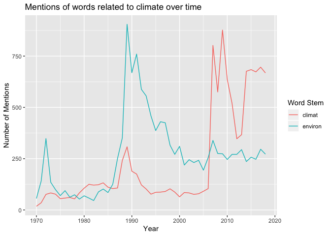

Mapping the Politics of the New Global South, Progress Update
================
Neeraj Sharma
7/31/2019

# Stop Words

This is a list of stemmed words that appear so much in the dataset that
they are essentially noise. This is a list object that is called later
on to remove these so-called “stop words.” I have listed them out here
so the reader is aware what UN-specific words have been cleaned out of
the data. I reference data about country references in my notes, but
they will not appear in these graphs.

``` r
UN_stop_words <- tibble(words = c("nation", 
                                  "unit", 
                                  "intern", 
                                  "countri", 
                                  "develop", 
                                  "peac",
                                  "world",
                                  "peopl",
                                  "deleg",
                                  # Stops countries from counting their own names as very commonly repeated words. Stripping removes casing. This takes codelist from countrycode. It might be bad because it eliminates when speeches mention other countries. 
                                  strip(codelist$country.name.en)
                                  ))
```

# Looking at specific countries common words over time

I was encouraged by Professor Bradley to investigate keyword trends over
time in the following countries:

  - Indonesia
  - Algeria
  - Kenya
  - Mexico
  - Egypt

What I’ve done is to group the speeches of each country into 5 year
increments and then took the top 10 words identified in each chunk. This
allows us to see what keywords rise and fall over time. Here is what
emerged based on this analysis.

## Indonesia

<!-- -->

Interesting observations:

  - The word “Partnership” arises in the range of 2006-2010. This is
    interesting because it’s right at the start of the rise of the usage
    of the term “Global South” per my understanding, which is importent
    as it indicates a shift towards a cooperative outlook towards
    foreign policy potentially.
  - ASEAN becoming a continually present term starting in 2000.
  - Words like “commit,” “goal,” etc. appear more in the later years.
    Generally, the tone is more outward looking and cooperative.

## Algeria

<!-- -->

Interesting observations:

  - Terrorism is a key phrase mentioned a lot during the later period of
    the civil war.
  - Crisis is said a lot in 1980s. Not exactly sure why that’s the case.
    I don’t know much about Algeria but my quick internet investigation
    couldn’t reveal anything obvious.
  - Any changes from 1970 to 2018 not as apparent as other countries.
    It’s not the most revealing country to see changes in the
    discourse surrounding development.

## Kenya

<!-- -->

Interesting observations:

  - Cooperate and global appear as keywords in 1990-1995.
  - Language of cooperation definately has changed in the early period
    compared to the late period.
  - Relations with Somalia seem to be very important in the late 2000s.
    They seem to have started campaigns against Al-Shabab around that
    time.
  - This trend appears to continue through the rest of the 2000s with
    mentions of Sudan, Somalia again, Support, and Sustain.

## Mexico

<!-- -->

Interesting observations:

  - Human rights are a big deal in 200s onward period recently.
    Especially in 2015, they are at the forefront of topics discussed.
  - Drug crime and climate change are themes in 2000s
  - Nuclear weapons and international security appear to be concerns for
    Mexico? The terms appear frequently in multiple different decades
    which indicates a continuing interest in this topic. It obviously
    makes sense given that nuclear technology is always a concern for
    nations, but it seems interesting for a country that has renounced
    the ability to make weapons (Treaty of Tlatelolco, 1968).

## Egypt

<!-- -->

Interesting observations:

  - Egypt talks about Palestine a lot, especially in the early periods
    of this analysis. That is not surprising AT ALL.
  - While some countries focus on economy in their speeches, Egypt has
    not made it a focus of their speeches. Rather, their concern seems
    much more rooted in the geopolitics of North Africa. They mention
    the Arab World, Palestine, and Africa and words related to policy in
    these areas much more than words like global or economy.

# Common Words by Decade

``` r
words_decades <- unigrams_corpus_1970on %>%
  mutate(decade = paste0(substr(Year, 1, 3), "0s", sep = "")) %>%
  anti_join(UN_stop_words, by = c("word_stem" = "words")) %>%
  group_by(decade) %>%
  count(word_stem) %>%
  group_by(decade) %>%
  top_n(n = 10) %>%
  mutate(percent = n/sum(n)) %>%
  arrange(desc(n), .by_group = TRUE) %>%
  ungroup() %>%
  mutate(decade = as.factor(decade),
           name = reorder_within(word_stem, n, decade))
```

``` r
ggplot(data = words_decades, mapping = aes(x = name, y = n, label = n)) +
  geom_col() +
  geom_text(hjust = 1.1, size = 3, fontface = "bold", color = "White") +
  coord_flip() +
  scale_x_reordered() +
  scale_y_continuous(expand = c(0,0)) +
  facet_wrap(~ decade, scales = "free_y") +
  labs(title = "Most common words over time (all nations)", x = "Words (Stemmed)", y = "Number of Mentions")
```

<!-- -->

Old example I have written that works well to provide an alternative way
of graphing words over time. This is being kept here just for example’s
sake and isn’t doesn’t have good underlying data.

``` r
seventies_freq <- unigrams_corpus_1970on %>%
  filter(Year == 1970 ) %>%
  anti_join(UN_stop_words, by = c("word_stem" = "words")) %>%
  group_by(word_stem) %>%
  count(sort = TRUE) %>%
  arrange(desc(n)) %>%
  ungroup() %>%
  mutate(percent = n/sum(n))


ggplot(data = seventies_freq %>% slice(1:10), mapping = aes(x = reorder(word_stem, n), y = n, label = n)) +
  geom_col() +
  geom_text(hjust = 1.5, fontface = "bold", color = "White") +
  coord_flip() +
  labs(title = "Most common words in 1970", x = "Words (Stemmed)", y = "Number of Mentions")
```

<!-- -->

# Common words using 1989 as the dividing point

``` r
words_divided <- unigrams_corpus_1970on %>%
  mutate(Era = if_else(Year <= 1989, "1 Before or Equal to 1989", "2 After 1989")) %>%
  anti_join(UN_stop_words, by = c("word_stem" = "words")) %>%
  group_by(Era) %>%
  count(word_stem) %>%
  group_by(Era) %>%
  top_n(n = 10) %>%
  mutate(percent = n/sum(n)) %>%
  arrange(desc(n), .by_group = TRUE) %>%
  ungroup() %>%
  mutate(Era = as.factor(Era),
           name = reorder_within(word_stem, n, Era))
```

``` r
ggplot(data = words_divided, mapping = aes(x = name, y = n, label = n)) +
  geom_col() +
  geom_text(hjust = 1.1, size = 3, fontface = "bold", color = "White") +
  coord_flip() +
  scale_x_reordered() +
  scale_y_continuous(expand = c(0,0)) +
  facet_wrap(~ Era, scales = "free_y") +
  labs(title = "Most common words over time (Split by Era)", x = "Words (Stemmed)", y = "Number of Mentions")
```

<!-- -->

# Looking at specific words overtime globally

``` r
overtime <- unigrams_corpus_1970on %>%
  anti_join(UN_stop_words, by = c("word_stem" = "words")) %>%
  filter(word_stem == "environ" | word_stem == "climat" | word_stem == "resili" | word_stem == "sustain" | word_stem == "capabl") %>%
  # hybriditiy never mentioned
  group_by(Year, word_stem) %>%
  count()

others_overtime <- overtime %>%
  filter(word_stem == "resili"  | word_stem == "capabl")

cc_overtime <- overtime %>%
  filter(word_stem == "climat" | word_stem == "environ")

ggplot(data = overtime, mapping = aes(x = Year, y = n, color = word_stem)) +
  geom_path() +
  labs(title = "Count of focus words over time", y = "Number of Mentions", color = "Word Stem")
```

<!-- -->

``` r
ggplot(data = others_overtime, mapping = aes(x = Year, y = n, color = word_stem)) +
  geom_path() +
  labs(title = "Mentions of words related to capacity over time", y = "Number of Mentions", color = "Word Stem")
```

<!-- -->

``` r
ggplot(data = cc_overtime, mapping = aes(x = Year, y = n, color = word_stem)) +
  geom_path() +
  labs(title = "Mentions of words related to climate over time", y = "Number of Mentions", color = "Word Stem")
```

<!-- -->

# Sentiment Analysis

This is for a later time and wasn’t the focus of this project update.
I’m keeping this here just so I have it in my backpocket for when it
does become important later on in the
project.

``` r
# corpus_affin df only contains words that have affinities mapped to them
unigrams_corpus_affin <- unigrams_corpus_1970on %>% 
  inner_join(get_sentiments("afinn"), by = c("word_stem" = "word"))

bigrams_corpus_affin <- bigrams_corpus_1970on %>% 
  inner_join(get_sentiments("afinn"), by = c("first_word_stem" = "word")) %>%
  inner_join(get_sentiments("afinn"), by = c("second_word_stem" = "word")) %>%
  mutate(mean_sentiment = (value.x+value.y)/2)
```
