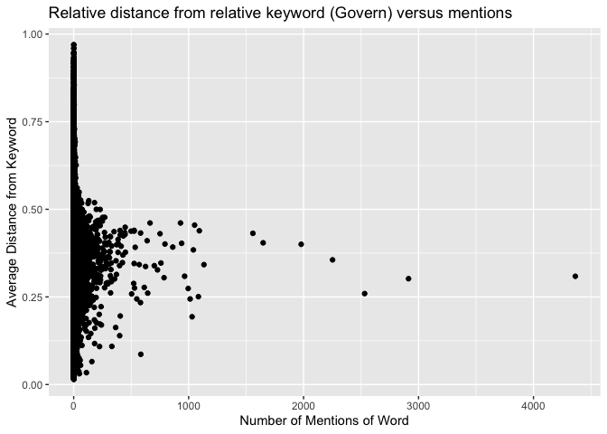
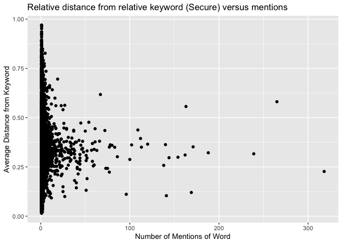
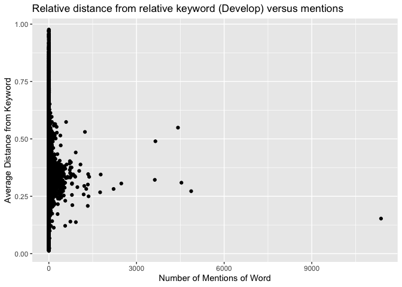
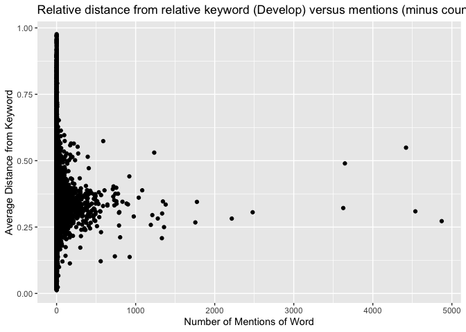
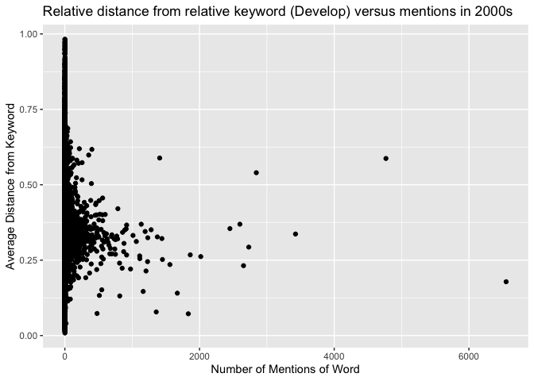
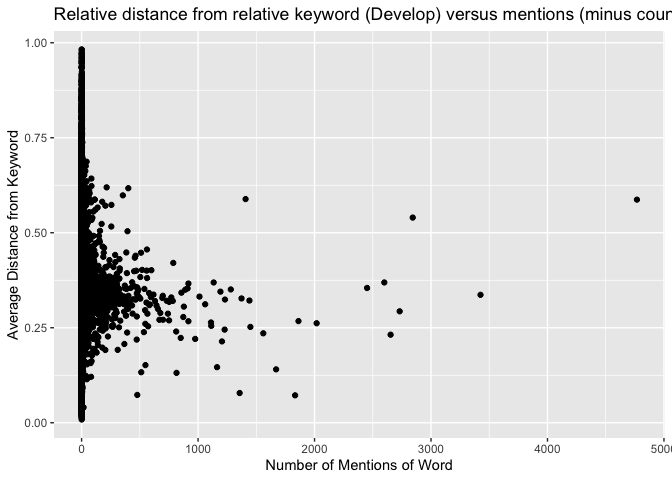

Global\_South\_Winter
================
Neeraj Sharma
3/2/2020

# Setup

Step one is the set up the environment. A number of packages are
necessary for this analysis.

``` r
# Relevant to data importation, structuring and visualization
library(tidyverse)
library(knitr)
library(readr)
library(here)
library(excelR)

# Relevant to data formatting
library(lubridate)
library(countrycode)

# Relevant to text analysis
library(tidytext)
library(stringr)
library(SnowballC)
library(textclean)
library(sentimentr)
library(tidyr)

# Used for webscraping. This created the global north/south divide exploration that I did in Fall 2019. 
library(rvest)

# Andres' fancy package for text analysis
library(reticulate)
library(cleanNLP)
reticulate::use_python("/Users/neerajsharma/opt/anaconda3/bin/python.app", required = TRUE)
# I'm running the spacy implimentation of the NLP backend. I'm not sure exactly what this means. 
cnlp_init_spacy()
```

This shows the python implimentation this project is run off of, as well
as the location of the cleanNLP package within this version of Anaconda
Python. On Feburary 26, 2020, I updated my Macbook Pro from macOS Mojave
to macOS Catalina. In the process of doing so, Anaconda Python (and thus
the primary text processing engine used) was bricked because macOS
refused to recognize developer-produced software in the root folder.
Additionally, I lost the most recent work on the
[Global\_South\_fall.rmd](https://github.com/nearridge/GlobalSouth/blob/master/Global_South_fall.md)
file. That was quite tragic and I’m not entirely sure if something super
important got lost, but I had a recent enough github backup so I was
able to do some very creative downloading.

``` r
reticulate::py_discover_config(required_module="cleannlp")
```

    ## python:         /Users/neerajsharma/opt/anaconda3/bin/python.app
    ## libpython:      /Users/neerajsharma/opt/anaconda3/lib/libpython3.7m.dylib
    ## pythonhome:     /Users/neerajsharma/opt/anaconda3:/Users/neerajsharma/opt/anaconda3
    ## version:        3.7.0 (default, Jun 28 2018, 07:39:16)  [Clang 4.0.1 (tags/RELEASE_401/final)]
    ## numpy:          /Users/neerajsharma/opt/anaconda3/lib/python3.7/site-packages/numpy
    ## numpy_version:  1.17.2
    ## cleannlp:       /Users/neerajsharma/opt/anaconda3/lib/python3.7/site-packages/cleannlp
    ## 
    ## NOTE: Python version was forced by use_python function

Step two is to import the corpus that I previously produced by
annotating every United Nations General Assembly speech from 1970 to the
present day. That was using corpus\_maker.r in roughly the manner
described below. While I was working on this project, I stored the
output of corpus\_maker.r in a handful of different locations. First, I
stored the full annotated corpus produced using cleanNLP on my desktop
and on UChicago box. I store secondary versions that were produced using
TidyText on GitHub. This was a rather inefficient method, but it’s in
the past.

To produce the corpus, the following approximate code was run in
corpus\_maker.r:

``` r
imported_files <- read_tsv(here("Data", "raw_speeches_mikhaylov_project.tsv"))
full_annotation <- cnlp_annotate(imported_files, as_strings = TRUE)
all_words_annotation <- cnlp_get_token(full_annotation)
write_tsv(all_words_annotation, "../../../../../Desktop/full_un_corpus_annotated.tsv", na = "NA", col_names = TRUE)
```

What this does is it reads in the .tsv file downloaded from the [Harvard
Dataverse](https://dataverse.harvard.edu/dataset.xhtml?persistentId=doi:10.7910/DVN/0TJX8Y)
that I store locally on my computer, then processes it through the
cleanNLP annotation scheme using the spaCy backend. This produces
analysis at several levels: tokens, sentences, and documents. For the
purposes of this analysis, I only analyze the token level. I only stayed
at this low-level of analysis for a few reasons.

First, I am a novice programmer. I basically took what I was able to
make work, and ran with it. Token-level analysis was the only thing that
I was able to really get working on a large scale with the database. I
corresponded with Andres Uribe
[(uribe@uchicago.edu)](uribe@uchicago.edu), a PhD student in the
Political Science department who is familiar with text analysis and R,
to impliment analysis around `get_sentences()` but I wasn’t able to make
that happen.

Secondly, Professor Bradley is most interested in tracking vocabularies
surrounding keywords. Vocabularies are made up of individual words, not
sentences of full documents. As a result, the unit of communcation
Professor Bradley is most interested in analyzing at this point is
words, so I focus almost all my efforts on words
alone.

## Functions to determine the location of keywords, sentences around keywords, and distances between words

Next are three functions that are relevant to nuanced text analysis.

First, I wrote a function to identify each sentence in each speech that
contains a specific keyword. Even sentences that mention the keyword
multiple times work.

``` r
# returns full tidytext df of sentences containing a specific keyword
sentences_with_keyword <- function(df, keyword) {
  returner <- df %>%
    filter(lemma == keyword) %>% 
    select(id, sid) %>% 
    distinct() %>% 
    left_join(df)
  return(returner)
}
```

Secondly, I wrote a function that extends that by getting the sentence
before and after. This isn’t perfect, but it works well enough.
Sometimes duplicates or non-sentences are created but on large scales,
this is
trivial.

``` r
# This grabs the sentence in front of, the sentence itself, and the sentence behind the keyword. 
local_sentences_with_keyword <- function(df, keyword) {
  sentence_ids <- df %>%
    filter(lemma == keyword) %>% 
    select(id, sid) %>% 
    distinct()
  all_ids_sids <- all_words_only %>% 
    select(id, sid) %>% 
    distinct() 
  #need to lag it to the sid before and lead it to the sid after. Can't just use +1 and -1 because of weirdness in how data got processed. 
  before_middle_after_sentence_ids <- bind_rows(sentence_ids, sentence_ids %>% mutate(sid = sid - 1), sentence_ids %>% mutate(sid = sid + 1)) %>%
    distinct() %>%
    arrange(id, sid)
  returner <- semi_join(df, before_middle_after_sentence_ids) %>%
    arrange(id, sid)
  return(returner)
}
```

Finally, I wrote a function that finds out the distance between two
words in a string. It is my baby. It’s important because my (read:
Neeraj’s possibly misinformed) hypothesis is that words relevant to a
keyword will be said closer in a sentence to the keyword itself. At
minimum, important words will be mentioned a lot. The function is pretty
complicated but well coded and if a keyword is mentioned multiple times,
the distance from a word to the keyword is minimized.

``` r
# Builds a function that counts how far apart two words are.
# the df will almost allways be all_words_only
distance_between_words <- function(df, keyword) {
  sentence_length_of_all_sentences <- df %>%
    group_by(id, sid) %>%
    filter(row_number(tid) == n()) %>%
    select(id, sid, slength = tid)
  
  # This grabs all sentences with the keyword. It produces duplicates if the keyword appears multiple times. Those are removed later on.
  df_of_location_sentences_with_keyword <- df %>%
    filter(lemma == keyword) %>%
    select(id, sid) %>%
    mutate(sentence_number = row_number()) %>%
    unite(cat, c(id, sid), remove = FALSE) %>%
    mutate(is_duplicate = duplicated(cat)) %>%
    mutate(is_duplicate = if_else(is_duplicate == TRUE, TRUE, duplicated(cat, fromLast = TRUE))) %>%
    left_join(sentence_length_of_all_sentences)
  
  df_of_all_sentences_with_keyword <- inner_join(df, df_of_location_sentences_with_keyword) %>% select(id, sid, cat, tid, slength, word, lemma, sentence_number, is_duplicate)
  # # Begin distance_between_words
  sentences_containing_keyword <- df_of_all_sentences_with_keyword
  
  location_of_keywords_in_each_sentence <- sentences_containing_keyword %>%
    mutate(keyword_row_number = if_else(lemma == keyword, location <- tid, 0)) %>%
    filter(lemma == keyword) %>%
    select(sentence_number, keyword_row_number)
  export <- inner_join(sentences_containing_keyword, location_of_keywords_in_each_sentence, by = ("sentence_number")) %>%
    unite(cat, c(cat, tid), remove = FALSE) %>%
    mutate(distance_between_word_and_keyword = abs(keyword_row_number - tid)) %>%
    mutate(compare_value = if_else(is_duplicate, lead(distance_between_word_and_keyword), 0)) %>%
    distinct(cat, .keep_all = TRUE) %>%
    mutate(distance_between_word_and_keyword = if_else(is_duplicate, pmin(distance_between_word_and_keyword, compare_value), distance_between_word_and_keyword)) %>%
    mutate(distance_from_keyword_percent = distance_between_word_and_keyword/slength)
  return(export)
}
```

# Analysis

When we first started out in the Fall, we thought that the words we were
most interested in were:

  - Govern-
  - Develop-
  - Secur-

and any relevant derivatives of them. Those are words that I tagged when
they appeared in a speech. I need to update the next three sections of
code to reflect the current function that gets distances between words
and abilities to do the entire timespan of the corpus; not just 1970 to
1979.

## Mentions of Govern with related words form the 1970 to 1979 corpus

``` r
distance_between_govern_other_words <- distance_between_words(all_words_only_1970, "govern") %>%
  select(id, sid, word, lemma, slength, distance_between_word_and_keyword, distance_from_keyword_percent) %>%
  anti_join(stop_words) %>%
  group_by(lemma) %>%
  summarise(count = n(), mean(distance_from_keyword_percent)) %>%
  slice(27:n()) %>%
  arrange(-count) %>%
  filter(lemma != "govern")
```

    ## Joining, by = c("id", "sid")
    ## Joining, by = c("id", "sid")

    ## Joining, by = "word"

``` r
ggplot(distance_between_govern_other_words, mapping = aes(`count`, `mean(distance_from_keyword_percent)`)) +
  geom_point() +
  labs(x = "Number of Mentions of Word", y = "Average Distance from Keyword", title = "Relative distance from relative keyword (Govern) versus mentions")
```

<!-- -->

``` r
# related words: scatter plot with count of total times said on x axis and distance from govern on y axis
# for some reason, the sentence division within the annotated_imported_files object is empty so cnlp_get_sentences returns an empty dataframe. What do I need to configure differently to get a) sentences to be parsed by the cnlp_annotate function up here and b) extract actual sentences and any information at that level.
kable(distance_between_govern_other_words %>% slice(1:15))
```

| lemma         | count | mean(distance\_from\_keyword\_percent) |
| :------------ | ----: | -------------------------------------: |
| pron          |  4364 |                              0.3088577 |
| people        |  2913 |                              0.3020368 |
| the           |  2531 |                              0.2594704 |
| united        |  2252 |                              0.3557453 |
| country       |  1979 |                              0.4001479 |
| international |  1648 |                              0.4043956 |
| nations       |  1559 |                              0.4315169 |
| states        |  1133 |                              0.3420868 |
| world         |  1093 |                              0.4387548 |
| republic      |  1085 |                              0.2507780 |
| develop       |  1052 |                              0.4548922 |
| assembly      |  1041 |                              0.3841942 |
| state         |  1030 |                              0.1934079 |
| south         |  1013 |                              0.2441387 |
| support       |   996 |                              0.2740290 |

## Mentions of Secure with related words form the 1970 to 1979 corpus

``` r
distance_between_secure_other_words <- distance_between_words(all_words_only_1970, "secure") %>%
  select(id, sid, word, lemma, slength, distance_between_word_and_keyword, distance_from_keyword_percent) %>%
  anti_join(stop_words) %>%
  group_by(lemma) %>%
  summarise(count = n(), mean(distance_from_keyword_percent)) %>%
  slice(24:n()) %>%
  arrange(-count) %>%
  filter(lemma != "secure")
```

    ## Joining, by = c("id", "sid")
    ## Joining, by = c("id", "sid")

    ## Joining, by = "word"

``` r
ggplot(distance_between_secure_other_words, mapping = aes(`count`, `mean(distance_from_keyword_percent)`)) +
  geom_point() +
  labs(x = "Number of Mentions of Word", y = "Average Distance from Keyword", title = "Relative distance from relative keyword (Secure) versus mentions")
```

<!-- -->

``` r
kable(distance_between_secure_other_words %>% slice(1:15))
```

| lemma         | count | mean(distance\_from\_keyword\_percent) |
| :------------ | ----: | -------------------------------------: |
| peace         |   318 |                              0.2269418 |
| pron          |   265 |                              0.5809695 |
| people        |   239 |                              0.3166736 |
| world         |   188 |                              0.3218985 |
| country       |   171 |                              0.3519784 |
| recognize     |   169 |                              0.1203065 |
| the           |   163 |                              0.5567938 |
| international |   162 |                              0.3105630 |
| israel        |   154 |                              0.2991619 |
| states        |   144 |                              0.2968760 |
| boundary      |   141 |                              0.1040082 |
| united        |   140 |                              0.3632544 |
| right         |   138 |                              0.2578147 |
| nations       |   120 |                              0.3655365 |
| develop       |   113 |                              0.3503016 |

## Mentions of Develop with related words form the 1970 to 1979 corpus

``` r
distance_between_develop_other_words <- distance_between_words(all_words_only_1970, "develop") %>%
  select(id, sid, word, lemma, slength, distance_between_word_and_keyword, distance_from_keyword_percent) %>%
  anti_join(stop_words) %>%
  group_by(lemma) %>%
  summarise(count = n(), mean(distance_from_keyword_percent)) %>%
  slice(215:n()) %>%
  arrange(-count) %>%
  filter(lemma != "develop")
```

    ## Joining, by = c("id", "sid")
    ## Joining, by = c("id", "sid")

    ## Joining, by = "word"

``` r
ggplot(distance_between_develop_other_words, mapping = aes(`count`, `mean(distance_from_keyword_percent)`)) +
  geom_point() +
  labs(x = "Number of Mentions of Word", y = "Average Distance from Keyword", title = "Relative distance from relative keyword (Develop) versus mentions")
```

<!-- -->

``` r
# that thing sitting all alone at 21 k is "country" unsurprisingly
ggplot(distance_between_develop_other_words %>% filter(lemma != "country"), mapping = aes(`count`, `mean(distance_from_keyword_percent)`)) +
  geom_point() +
  labs(x = "Number of Mentions of Word", y = "Average Distance from Keyword", title = "Relative distance from relative keyword (Develop) versus mentions (minus country)")
```

<!-- -->

``` r
kable(distance_between_develop_other_words %>% slice(1:15))
```

| lemma         | count | mean(distance\_from\_keyword\_percent) |
| :------------ | ----: | -------------------------------------: |
| country       | 11370 |                              0.1529402 |
| economic      |  4871 |                              0.2723424 |
| international |  4538 |                              0.3092513 |
| pron          |  4420 |                              0.5490999 |
| the           |  3647 |                              0.4897497 |
| world         |  3626 |                              0.3216598 |
| united        |  2480 |                              0.3057610 |
| nations       |  2216 |                              0.2819746 |
| people        |  1775 |                              0.3448721 |
| operation     |  1755 |                              0.2675153 |
| states        |  1380 |                              0.3348484 |
| nation        |  1359 |                              0.2497759 |
| peace         |  1345 |                              0.3465467 |
| resource      |  1335 |                              0.3011712 |
| social        |  1332 |                              0.2080895 |

We had previously only looked at 1970 to 1979. Develop is super meaty,
so we’ll try to do some analysis on stuff way after 1979. We should
expect to see some significant differences in the language of say, the
2000s compared to the language of the 1970s.

Lets get an annotated corpus over 2000 to 2009.

ITS GONE NOW AND HAS MOVED WAY UP TO THE START SETUP

Now lets look at develop and compare it to 1970s stuff. Especially in
the context of a specific nation, say
Indonesia.

``` r
distance_between_develop_other_words_2k <- distance_between_words(all_words_only_2k, "develop") %>%
  select(id, sid, word, lemma, slength, distance_between_word_and_keyword, distance_from_keyword_percent) %>%
  anti_join(stop_words) %>%
  group_by(lemma) %>%
  summarise(count = n(), mean(distance_from_keyword_percent)) %>%
  slice(87:n()) %>%
  arrange(-count) %>%
  filter(lemma != "develop")
```

    ## Joining, by = c("id", "sid")
    ## Joining, by = c("id", "sid")

    ## Joining, by = "word"

``` r
ggplot(distance_between_develop_other_words_2k, mapping = aes(`count`, `mean(distance_from_keyword_percent)`)) +
  geom_point() +
  labs(x = "Number of Mentions of Word", y = "Average Distance from Keyword", title = "Relative distance from relative keyword (Develop) versus mentions in 2000s")
```

<!-- -->

``` r
# that thing sitting all alone at 8.8 k is "country" unsurprisingly
ggplot(distance_between_develop_other_words_2k %>% filter(lemma != "country"), mapping = aes(`count`, `mean(distance_from_keyword_percent)`)) +
  geom_point() +
  labs(x = "Number of Mentions of Word", y = "Average Distance from Keyword", title = "Relative distance from relative keyword (Develop) versus mentions (minus country) in 2000s")
```

<!-- -->

``` r
kable(distance_between_develop_other_words_2k %>% slice(1:15))
```

| lemma         | count | mean(distance\_from\_keyword\_percent) |
| :------------ | ----: | -------------------------------------: |
| country       |  6553 |                              0.1784306 |
| pron          |  4768 |                              0.5871054 |
| international |  3425 |                              0.3366388 |
| the           |  2843 |                              0.5399266 |
| world         |  2731 |                              0.2933059 |
| economic      |  2653 |                              0.2317195 |
| united        |  2599 |                              0.3692089 |
| nations       |  2451 |                              0.3546518 |
| peace         |  2018 |                              0.2618614 |
| security      |  1862 |                              0.2675499 |
| sustainable   |  1833 |                              0.0722118 |
| millennium    |  1670 |                              0.1405439 |
| human         |  1560 |                              0.2354107 |
| states        |  1449 |                              0.2521979 |
| global        |  1441 |                              0.3216451 |

# TFIDF

The most recent breakthrough has been on TFIDF.

``` r
#List of countries for filtering
country_filter <- str_to_lower(pull(codelist, country.name.en)) 
# I DONT WANT TO STEM RIGHT NOW. THAT MEANS RIGHT AND RIGHTS ARE DIFFERENT THINGS
# Brute force adds stemming but this is kinda unnecessary because lemma works well enough, at least so far.
#all_words_only <- all_words_only %>%
#  mutate(word_stem = wordStem(lemma))
# Takes in a df of the words that appear in a sentence containing a keyword and returns a df of words that appear within a certain range of years. 
# Common ranges of years: a decade, each year, five years. 
# Example question this function answers: What were the most important words to govern in a 5 year period?
tfidfer <- function(df, start_year, up_to) {
  tfidf_over_range <- df %>%
    filter(Year %in% seq(start_year, start_year + up_to)) %>%
    bind_tf_idf(lemma, id, n) %>%
    filter(lemma %in% country_filter == FALSE) %>%
    anti_join(stop_words, by = c("lemma" = "word"))
  return(tfidf_over_range)
}
# Function that gets the top tfidf words in each year. This is applied to a dataframe that already has done tfidf analyis on a bunch of words related to a keyword over a period of time.
# The keyword technically does not matter for this function. 
tfidf_aux_word_organizer <- function(df_of_tfidf_of_every_individual_word) {
  df_of_tfidf_of_every_individual_word <- df_of_tfidf_of_every_individual_word %>% 
    separate(id, c("Country", "Session", "Year")) %>%
    group_by(Year, lemma) %>%
    summarize(mean_tfidf = mean(tf_idf), n = n()) %>%
    filter(n >= 5) %>%
    ungroup() %>%
    mutate(ratio = mean_tfidf/n) %>%
    arrange(desc(ratio)) %>%
    filter(lemma != "develop" 
           & lemma != "pron" 
           & lemma != "people" 
           & lemma != ""
           & lemma != "country"
           & lemma != "countries"
           & lemma != ""
           & lemma != "united"
           & lemma != "nation"
           & lemma != "nations"
           & lemma != "international"
           & lemma != "'s") %>% group_by(Year) %>% top_n(n = 10) 
  return(df_of_tfidf_of_every_individual_word)
}
printer_producer <- function(dataframe) {
  dataframe <- dataframe %>% 
    arrange(-desc(Year))
  data <- list()
  for (i in seq(as.double(min(dataframe$Year)), as.double(max(dataframe$Year)))) {
    data <- bind_cols(data, dataframe %>% filter(Year == i))
  }
  return(data)
}
```

## TFIDF for stuff related to govern.

Single sentence.

``` r
# note that this produces an unstemmed all_words_only. 
sentences_mention_govern <- sentences_with_keyword(all_words_only, "govern")
```

    ## Joining, by = c("id", "sid")

``` r
num_words_in_each_speech_mentioning_govern <- sentences_mention_govern %>% 
  count(id, lemma) %>% 
  group_by(id) %>%
  summarize(`words in speech` = sum(n))
mentions_of_aux_words_in_sentences_containing_govern <- left_join(sentences_mention_govern %>% count(id, lemma), num_words_in_each_speech_mentioning_govern) %>%
  separate(id, c("Country", "Session", "Year"), remove = FALSE)
```

    ## Joining, by = "id"

``` r
# tfidfer(mentions_of_aux_words_in_sentences_containing_govern, 1970, 9) %>% select(-Year, -Session, -Country) is equal to govern_full_tfidf_1970_ided
# furthermore, all of the govern_xxxxs equals the previous govern_full_tfidf_xxxx_yeared I previously had. Thus, it is the proper implimentation. 
govern_1970s <- tfidf_aux_word_organizer(tfidfer(mentions_of_aux_words_in_sentences_containing_govern, 1970, 9) %>% select(-Year, -Session, -Country))
```

    ## Selecting by ratio

``` r
govern_1980s <- tfidf_aux_word_organizer(tfidfer(mentions_of_aux_words_in_sentences_containing_govern, 1980, 9) %>% select(-Year, -Session, -Country))
```

    ## Selecting by ratio

``` r
govern_1990s <- tfidf_aux_word_organizer(tfidfer(mentions_of_aux_words_in_sentences_containing_govern, 1990, 9) %>% select(-Year, -Session, -Country))
```

    ## Selecting by ratio

``` r
govern_2000s <- tfidf_aux_word_organizer(tfidfer(mentions_of_aux_words_in_sentences_containing_govern, 2000, 9) %>% select(-Year, -Session, -Country))
```

    ## Selecting by ratio

``` r
govern_2010s <- tfidf_aux_word_organizer(tfidfer(mentions_of_aux_words_in_sentences_containing_govern, 2010, 9) %>% select(-Year, -Session, -Country))
```

    ## Selecting by ratio

``` r
govern_alltime <- bind_rows(printer_producer(govern_1970s), printer_producer(govern_1980s), printer_producer(govern_1990s), printer_producer(govern_2000s), printer_producer(govern_2010s))
```

Local Sentences
included.

``` r
local_sentences_mention_govern <- local_sentences_with_keyword(all_words_only, "govern")
```

    ## Joining, by = c("id", "sid")

``` r
num_words_insentences_locally_mentioning_govern <- local_sentences_mention_govern %>% 
  count(id, lemma) %>% 
  group_by(id) %>%
  summarize(`words in speech` = sum(n))
mentions_of_aux_words_in_localsentences_containing_govern <- left_join(local_sentences_mention_govern %>% count(id, lemma), num_words_insentences_locally_mentioning_govern) %>%
  separate(id, c("Country", "Session", "Year"), remove = FALSE)
```

    ## Joining, by = "id"

``` r
extended_govern_1970s <- tfidf_aux_word_organizer(tfidfer(mentions_of_aux_words_in_localsentences_containing_govern, 1970, 9) %>% select(-Year, -Session, -Country))
```

    ## Selecting by ratio

``` r
extended_govern_1980s <- tfidf_aux_word_organizer(tfidfer(mentions_of_aux_words_in_localsentences_containing_govern, 1980, 9) %>% select(-Year, -Session, -Country))
```

    ## Selecting by ratio

``` r
extended_govern_1990s <- tfidf_aux_word_organizer(tfidfer(mentions_of_aux_words_in_localsentences_containing_govern, 1990, 9) %>% select(-Year, -Session, -Country))
```

    ## Selecting by ratio

``` r
extended_govern_2000s <- tfidf_aux_word_organizer(tfidfer(mentions_of_aux_words_in_localsentences_containing_govern, 2000, 9) %>% select(-Year, -Session, -Country))
```

    ## Selecting by ratio

``` r
extended_govern_2010s <- tfidf_aux_word_organizer(tfidfer(mentions_of_aux_words_in_localsentences_containing_govern, 2010, 9) %>% select(-Year, -Session, -Country))
```

    ## Selecting by ratio

``` r
#View(bind_rows(printer_producer(extended_govern_1970s), printer_producer(extended_govern_1980s), printer_producer(extended_govern_1990s), printer_producer(extended_govern_2000s), printer_producer(extended_govern_2010s)))

excelTable(bind_rows(printer_producer(extended_govern_1970s),printer_producer(extended_govern_1980s),printer_producer(extended_govern_1990s),
                     printer_producer(extended_govern_2000s),printer_producer(extended_govern_2010s)), editable = FALSE, pagination = 10)
```

    ## Warning in excelTable(bind_rows(printer_producer(extended_govern_1970s), :
    ## Since both column title and colHeaders are not specified 'data' column name
    ## will be used as column headers

    ## Since 'type' attribute is not specified and autoColTypes is true, detecting type from 'data'

    ## PhantomJS not found. You can install it with webshot::install_phantomjs(). If it is installed, please make sure the phantomjs executable can be found via the PATH variable.

<!--html_preserve-->

<div id="htmlwidget-cc19b3f1681221009f0c" class="jexcel html-widget" style="width:0px;height:0px;">

</div>

<script type="application/json" data-for="htmlwidget-cc19b3f1681221009f0c">{"x":{"data":[["1970","abdel",0.0246,6,0.0041,"1971","february",0.0135,5,0.0027,"1972","massacre",0.0208,5,0.0042,"1973","penh",0.0215,5,0.0043,"1974","da",0.0239,5,0.0048,"1975","reactionary",0.0174,5,0.0035,"1976","mediterranean",0.0224,5,0.0045,"1977","accession",0.0243,5,0.0049,"1978","anxiety",0.0342,6,0.0057,"1979","asean",0.0221,6,0.0037],["1970","gamal",0.0246,6,0.0041,"1971","test",0.0134,5,0.0027,"1972","asians",0.0204,5,0.0041,"1973","phnom",0.0215,5,0.0043,"1974","junta",0.0273,6,0.0045,"1975","mass",0.0158,5,0.0032,"1976","timor",0.0265,7,0.0038,"1977","devotion",0.0166,5,0.0033,"1978","powerful",0.023,5,0.0046,"1979","willingness",0.017,5,0.0034],["1970","loss",0.0184,5,0.0037,"1971","commemorative",0.0124,5,0.0025,"1972","vis",0.0179,5,0.0036,"1973","prisoner",0.0178,5,0.0036,"1974","favor",0.035,9,0.0039,"1975","pride",0.0157,5,0.0031,"1976","hamilton",0.0188,5,0.0038,"1977","guideline",0.0187,6,0.0031,"1978","fall",0.0183,5,0.0037,"1979","french",0.0165,5,0.0033],["1970","condolence",0.0192,6,0.0032,"1971","pacific",0.0144,6,0.0024,"1972","inhabitant",0.021,6,0.0035,"1973","feeling",0.0163,5,0.0033,"1974","attack",0.0164,5,0.0033,"1975","utilization",0.0148,5,0.003,"1976","industrial",0.0187,5,0.0037,"1977","french",0.0186,6,0.0031,"1978","preservation",0.0202,6,0.0034,"1979","jerusalem",0.016,5,0.0032],["1970","stage",0.0145,5,0.0029,"1971","jerusalem",0.0142,6,0.0024,"1972","related",0.0174,5,0.0035,"1973","previous",0.0162,5,0.0032,"1974","devotion",0.0164,5,0.0033,"1975","el",0.0145,5,0.0029,"1976","tragedy",0.0195,7,0.0028,"1977","korea",0.0185,6,0.0031,"1978","distribution",0.0161,5,0.0032,"1979","ability",0.0151,5,0.003],["1970","hijacker",0.0137,5,0.0027,"1971","jarring",0.0185,8,0.0023,"1972","khmer",0.017,5,0.0034,"1973","inhuman",0.0156,5,0.0031,"1974","paigc",0.0141,5,0.0028,"1975","coastal",0.0145,5,0.0029,"1976","february",0.0154,6,0.0026,"1977","torture",0.0152,5,0.003,"1978","hijacking",0.0146,5,0.0029,"1979","egyptian",0.0207,7,0.003],["1970","nasser",0.0238,9,0.0026,"1971","indonesian",0.0105,5,0.0021,"1972","town",0.0159,5,0.0032,"1973","spanish",0.018,6,0.003,"1974","outcome",0.0122,5,0.0024,"1975","chilean",0.014,5,0.0028,"1976","foremost",0.0126,5,0.0025,"1977","commercial",0.0147,5,0.0029,"1978","bank",0.0141,5,0.0028,"1979","plo",0.0202,7,0.0029],["1970","sum",0.0118,5,0.0024,"1971","personally",0.0103,5,0.0021,"1972","civilian",0.0158,5,0.0032,"1973","khmer",0.0202,7,0.0029,"1974","cypriot",0.012,5,0.0024,"1975","type",0.0164,6,0.0027,"1976","attribute",0.0124,5,0.0025,"1977","rebellion",0.0139,5,0.0028,"1978","secretariat",0.0134,5,0.0027,"1979","pol",0.0135,5,0.0027],["1970","suggestion",0.0114,5,0.0023,"1971","powerful",0.0103,5,0.0021,"1972","scourge",0.0148,5,0.003,"1973","hour",0.0131,5,0.0026,"1974","condemnation",0.0116,5,0.0023,"1975","corporation",0.0136,5,0.0027,"1976","simply",0.017,7,0.0024,"1977","thinking",0.0166,6,0.0028,"1978","environment",0.0134,5,0.0027,"1979","counter",0.0133,5,0.0027],["1970","palestinian",0.0109,5,0.0022,"1971","respond",0.0097,5,0.0019,"1972","neo",0.0143,5,0.0029,"1973","perspective",0.0131,5,0.0026,"1974","lisbon",0.0137,6,0.0023,"1975","capable",0.0122,5,0.0024,"1976","length",0.0121,5,0.0024,"1977","brutal",0.0138,5,0.0028,"1978","brotherly",0.0133,5,0.0027,"1979","muzorewa",0.0181,7,0.0026],["1980","rate",0.0168,5,0.0034,"1981","ai i",0.0377,5,0.0075,"1982","federal",0.0258,6,0.0043,"1983","indian",0.0222,5,0.0044,"1984","brotherly",0.0243,5,0.0049,"1985","entail",0.0305,5,0.0061,"1986","skillful",0.0276,5,0.0055,"1987","french",0.0322,7,0.0046,"1988","toxic",0.0257,5,0.0051,"1989","intifadah",0.0269,5,0.0054],["1980","salim",0.0195,6,0.0032,"1981","egyptian",0.0229,5,0.0046,"1982","consent",0.0187,5,0.0037,"1983","scheme",0.0168,5,0.0034,"1984","positively",0.0198,5,0.004,"1985","weaken",0.0259,5,0.0052,"1986","religious",0.0182,5,0.0036,"1987","concerted",0.0202,5,0.004,"1988","management",0.0186,5,0.0037,"1989","governmental",0.0226,5,0.0045],["1980","doom",0.0154,5,0.0031,"1981","daniel",0.0194,5,0.0039,"1982","protectionist",0.0183,5,0.0037,"1983","held",0.0155,5,0.0031,"1984","gulf",0.0188,5,0.0038,"1985","commemoration",0.022,6,0.0037,"1986","anti",0.0175,5,0.0035,"1987","islands",0.0178,5,0.0036,"1988","momentum",0.0182,5,0.0036,"1989","fee",0.0252,6,0.0042],["1980","iranian",0.0227,8,0.0028,"1981","disturb",0.0174,5,0.0035,"1982","legality",0.0182,5,0.0036,"1983","chinese",0.0151,5,0.003,"1984","assert",0.0175,5,0.0035,"1985","instal",0.0167,5,0.0033,"1986","science",0.0155,5,0.0031,"1987","caledonia",0.0212,6,0.0035,"1988","company",0.0179,5,0.0036,"1989","mobilize",0.019,5,0.0038],["1980","embassy",0.0169,6,0.0028,"1981","seabed",0.0172,5,0.0034,"1982","countrie",0.0173,5,0.0035,"1983","translate",0.0133,5,0.0027,"1984","rise",0.0167,5,0.0033,"1985","behavior",0.0157,5,0.0031,"1986","regular",0.0147,5,0.0029,"1987","indigenous",0.015,5,0.003,"1988","debtor",0.0196,6,0.0033,"1989","marti",0.0171,5,0.0034],["1980","pacific",0.0136,5,0.0027,"1981","define",0.0171,5,0.0034,"1982","launching",0.0148,5,0.003,"1983","colonialist",0.0128,5,0.0026,"1984","dedicate",0.0193,6,0.0032,"1985","water",0.0156,5,0.0031,"1986","parliament",0.0175,6,0.0029,"1987","german",0.0178,6,0.003,"1988","loan",0.0156,5,0.0031,"1989","complex",0.0167,5,0.0033],["1980","reasonable",0.0134,5,0.0027,"1981","sadat",0.019,6,0.0032,"1982","mile",0.0165,6,0.0027,"1983","align",0.0149,6,0.0025,"1984","education",0.0159,5,0.0032,"1985","cost",0.018,6,0.003,"1986","catastrophe",0.0175,6,0.0029,"1987","illegally",0.0145,5,0.0029,"1988","nicaraguan",0.0185,6,0.0031,"1989","mutually",0.0162,5,0.0032],["1980","yesterday",0.0131,5,0.0026,"1981","relationship",0.0189,6,0.0031,"1982","prestige",0.0126,5,0.0025,"1983","vice",0.0146,6,0.0024,"1984","labour",0.0149,5,0.003,"1985","peoples",0.0139,5,0.0028,"1986","scientific",0.014,5,0.0028,"1987","rostrum",0.0198,7,0.0028,"1988","accords",0.0228,8,0.0029,"1989","chemical",0.0251,8,0.0031],["1980","register",0.0131,5,0.0026,"1981","memory",0.0149,5,0.003,"1982","highlight",0.0121,5,0.0024,"1983","pacific",0.0194,8,0.0024,"1984","annual",0.0148,5,0.003,"1985","fascism",0.015,6,0.0025,"1986","illicit",0.0138,5,0.0028,"1987","thinking",0.0141,5,0.0028,"1988","keen",0.0142,5,0.0028,"1989","segment",0.0153,5,0.0031],["1980","precedent",0.0128,5,0.0026,"1981","longterm",0.0139,5,0.0028,"1982","reconstruct",0.012,5,0.0024,"1983","informal",0.012,5,0.0024,"1984","dollar",0.0142,5,0.0028,"1985","original",0.0223,9,0.0025,"1986","subregion",0.0134,5,0.0027,"1987","servicing",0.0138,5,0.0028,"1988","nam",0.0169,6,0.0028,"1989","virgilio",0.0153,5,0.0031],["1990","lebanese",0.0242,5,0.0048,"1991","article",0.025,5,0.005,"1992","encounter",0.0278,5,0.0056,"1993","lebanese",0.028,5,0.0056,"1994","king",0.0433,5,0.0087,"1995","strength",0.0359,6,0.006,"1996","multilateralism",0.0465,5,0.0093,"1997","britain",0.0273,5,0.0055,"1998","saint",0.036,5,0.0072,"1999","undp",0.0572,6,0.0095],["1990","indian",0.0221,5,0.0044,"1991","augur",0.0187,5,0.0037,"1992","easy",0.0263,5,0.0053,"1993","french",0.0265,5,0.0053,"1994","minority",0.0265,5,0.0053,"1995","freitas",0.0593,10,0.0059,"1996","stockholm",0.0322,5,0.0064,"1997","concentrate",0.021,5,0.0042,"1998","flow",0.0314,5,0.0063,"1999","statute",0.0297,5,0.0059],["1990","german",0.0433,10,0.0043,"1991","pluralistic",0.018,5,0.0036,"1992","expert",0.0231,5,0.0046,"1993","decline",0.0219,5,0.0044,"1994","alternative",0.0227,5,0.0045,"1995","undp",0.0281,5,0.0056,"1996","tax",0.0256,5,0.0051,"1997","palestinians",0.0248,6,0.0041,"1998","track",0.037,6,0.0062,"1999","enrich",0.0341,6,0.0057],["1990","jaber",0.0212,5,0.0042,"1991","determined",0.0177,5,0.0035,"1992","strife",0.0219,5,0.0044,"1993","wrong",0.0216,5,0.0043,"1994","initial",0.0221,5,0.0044,"1995","boundary",0.0235,5,0.0047,"1996","copenhagen",0.0231,5,0.0046,"1997","device",0.0198,5,0.004,"1998","mine",0.0327,6,0.0055,"1999","internationally",0.0277,5,0.0055],["1990","detente",0.0256,7,0.0037,"1991","lebanese",0.021,6,0.0035,"1992","spread",0.0206,5,0.0041,"1993","equipment",0.0199,5,0.004,"1994","coalition",0.0186,5,0.0037,"1995","sarajevo",0.0225,5,0.0045,"1996","planning",0.0216,5,0.0043,"1997","additional",0.0196,5,0.0039,"1998","worlds",0.0267,5,0.0053,"1999","bissau",0.0291,6,0.0049],["1990","chance",0.0183,5,0.0037,"1991","geneva",0.0172,5,0.0034,"1992","camp",0.0203,5,0.0041,"1993","terrorist",0.019,5,0.0038,"1994","desertification",0.0217,6,0.0036,"1995","divide",0.0222,5,0.0044,"1996","sexual",0.0302,7,0.0043,"1997","excellent",0.0191,5,0.0038,"1998","enforcement",0.0261,5,0.0052,"1999","decent",0.0242,5,0.0048],["1990","wage",0.0181,5,0.0036,"1991","army",0.0169,5,0.0034,"1992","afghan",0.0197,5,0.0039,"1993","ten",0.0224,6,0.0037,"1994","define",0.0166,5,0.0033,"1995","democratically",0.0221,5,0.0044,"1996","labour",0.021,5,0.0042,"1997","preventive",0.0188,5,0.0038,"1998","afghan",0.0257,5,0.0051,"1999","greet",0.0235,5,0.0047],["1990","sheikh",0.018,5,0.0036,"1991","door",0.0169,5,0.0034,"1992","lebanese",0.0197,5,0.0039,"1993","translate",0.018,5,0.0036,"1994","phase",0.0164,5,0.0033,"1995","disaster",0.0215,5,0.0043,"1996","hear",0.0205,5,0.0041,"1997","interdependent",0.0187,5,0.0037,"1998","king",0.0228,5,0.0046,"1999","genocide",0.0262,6,0.0044],["1990","sight",0.0174,5,0.0035,"1991","assumption",0.0169,5,0.0034,"1992","technology",0.0193,5,0.0039,"1993","bosnian",0.0215,6,0.0036,"1994","facility",0.0162,5,0.0032,"1995","conventional",0.0213,5,0.0043,"1996","youth",0.0204,5,0.0041,"1997","modest",0.0183,5,0.0037,"1998","spread",0.0218,5,0.0044,"1999","powerful",0.0213,5,0.0043],["1990","al",0.0159,5,0.0032,"1991","aggravate",0.0166,5,0.0033,"1992","northern",0.0179,5,0.0036,"1993","peacemaking",0.0177,5,0.0035,"1994","plo",0.0189,6,0.0031,"1995","iraqi",0.0207,5,0.0041,"1996","background",0.0188,5,0.0038,"1997","assessment",0.0179,5,0.0036,"1998","wealth",0.0216,5,0.0043,"1999","humane",0.0207,5,0.0041],["2000","undp",0.0501,5,0.01,"2001","vis",0.0347,5,0.0069,"2002","company",0.0428,5,0.0086,"2003","indigenous",0.0768,5,0.0154,"2004","combatant",0.0399,5,0.008,"2005","pacific",0.0387,6,0.0065,"2006","hunger",0.0475,5,0.0095,"2007","bali",0.0644,5,0.0129,"2008","descoto",0.0674,5,0.0135,"2009","afghan",0.0668,6,0.0111],["2000","defence",0.0381,5,0.0076,"2001","miss",0.0329,5,0.0066,"2002","lusaka",0.0371,5,0.0074,"2003","chairman",0.0321,5,0.0064,"2004","genocide",0.0327,5,0.0065,"2005","realization",0.0294,5,0.0059,"2006","islands",0.0442,5,0.0088,"2007","islamic",0.0455,5,0.0091,"2008","brockmann",0.0656,5,0.0131,"2009","recession",0.0524,5,0.0105],["2000","revolution",0.0336,6,0.0056,"2001","islamic",0.0386,6,0.0064,"2002","transnational",0.0352,5,0.007,"2003","sars",0.031,5,0.0062,"2004","asian",0.0302,5,0.006,"2005","lebanese",0.0265,5,0.0053,"2006","phenomenon",0.0462,6,0.0077,"2007","kyoto",0.0358,5,0.0072,"2008","foodstuff",0.0423,5,0.0085,"2009","package",0.0476,5,0.0095],["2000","islands",0.0263,5,0.0053,"2001","atlantic",0.0296,5,0.0059,"2002","korean",0.0352,5,0.007,"2003","pave",0.0276,5,0.0055,"2004","allocate",0.0297,5,0.0059,"2005","cost",0.0262,5,0.0052,"2006","facility",0.0348,5,0.007,"2007","demonstrator",0.0339,5,0.0068,"2008","initiate",0.036,5,0.0072,"2009","renewable",0.041,5,0.0082],["2000","korea",0.0254,5,0.0051,"2001","peacekeeping",0.0248,5,0.005,"2002","abide",0.0304,5,0.0061,"2003","solomon",0.0395,8,0.0049,"2004","bougainville",0.029,5,0.0058,"2005","faith",0.0258,5,0.0052,"2006","obstacle",0.0356,6,0.0059,"2007","stress",0.0307,5,0.0061,"2008","sister",0.0334,5,0.0067,"2009","test",0.0467,6,0.0078],["2000","al",0.0241,5,0.0048,"2001","injustice",0.0241,5,0.0048,"2002","ocean",0.0304,5,0.0061,"2003","half",0.0243,5,0.0049,"2004","privilege",0.0288,5,0.0058,"2005","indicator",0.0255,5,0.0051,"2006","federal",0.0344,6,0.0057,"2007","march",0.0306,5,0.0061,"2008","produce",0.0324,5,0.0065,"2009","ki",0.0356,5,0.0071],["2000","assessment",0.0235,5,0.0047,"2001","somali",0.0222,5,0.0044,"2002","diplomacy",0.027,5,0.0054,"2003","tolerance",0.0242,5,0.0048,"2004","prosperous",0.0284,5,0.0057,"2005","proliferation",0.0245,5,0.0049,"2006","cooperate",0.0275,5,0.0055,"2007","warm",0.0304,5,0.0061,"2008","lebanese",0.0311,5,0.0062,"2009","moon",0.0356,5,0.0071],["2000","idea",0.0281,6,0.0047,"2001","sight",0.0203,5,0.0041,"2002","document",0.0259,5,0.0052,"2003","resolute",0.0229,5,0.0046,"2004","powerful",0.0275,5,0.0055,"2005","expect",0.0244,5,0.0049,"2006","assumption",0.0272,5,0.0054,"2007","arab",0.0361,6,0.006,"2008","neighbouring",0.0281,5,0.0056,"2009","generation",0.0328,5,0.0066],["2000","acceptable",0.0228,5,0.0046,"2001","avoid",0.02,5,0.004,"2002","function",0.0253,5,0.0051,"2003","perfect",0.0227,5,0.0045,"2004","jean",0.0273,5,0.0055,"2005","credibility",0.0242,5,0.0048,"2006","attach",0.0267,5,0.0053,"2007","planet",0.0279,5,0.0056,"2008","core",0.0253,5,0.0051,"2009","learn",0.0323,5,0.0065],["2000","zone",0.0268,6,0.0045,"2001","exclude",0.02,5,0.004,"2002","short",0.0289,6,0.0048,"2003","thousand",0.0224,5,0.0045,"2004","preparation",0.0268,5,0.0054,"2005","independence",0.0339,7,0.0048,"2006","double",0.0314,6,0.0052,"2007","north",0.0272,5,0.0054,"2008","legitimate",0.0248,5,0.005,"2009","reserve",0.0317,5,0.0063],["2010","kabul",0.057,5,0.0114,"2011","structure",0.0441,5,0.0088,"2012","pass",0.0398,5,0.008,"2013","islands",0.0388,5,0.0078,"2014","space",0.0487,5,0.0097,"2015","isil",0.0434,5,0.0087,"2016","libyan",0.0495,7,0.0071,"2017","precondition",0.0415,5,0.0083,"2018","ocean",0.0601,5,0.012,null,null,null,null,null],["2010","islands",0.0458,5,0.0092,"2011","repercussion",0.0406,5,0.0081,"2012","nato",0.0356,5,0.0071,"2013","afghan",0.0325,5,0.0065,"2014","fighter",0.0452,5,0.009,"2015","risk",0.0426,5,0.0085,"2016","vehicle",0.0353,5,0.0071,"2017","modern",0.0359,5,0.0072,"2018","myanmar",0.0554,5,0.0111,null,null,null,null,null],["2010","youth",0.0442,5,0.0088,"2011","parliamentary",0.0547,7,0.0078,"2012","feel",0.0335,5,0.0067,"2013","iranian",0.0445,7,0.0064,"2014","safe",0.0449,5,0.009,"2015","afghan",0.0426,6,0.0071,"2016","test",0.0318,5,0.0064,"2017","closely",0.0343,5,0.0069,"2018","teach",0.0349,5,0.007,null,null,null,null,null],["2010","february",0.0399,5,0.008,"2011","proliferation",0.0349,5,0.007,"2012","myanmar",0.0317,5,0.0063,"2013","unacceptable",0.0309,5,0.0062,"2014","syrian",0.0338,5,0.0068,"2015","scale",0.0329,5,0.0066,"2016","cease",0.03,5,0.006,"2017","indigenous",0.0334,5,0.0067,"2018","observe",0.0296,5,0.0059,null,null,null,null,null],["2010","terrible",0.0378,5,0.0076,"2011","disarmament",0.0339,5,0.0068,"2012","unconstitutional",0.0366,6,0.0061,"2013","participant",0.03,5,0.006,"2014","norm",0.0328,5,0.0066,"2015","membership",0.0327,5,0.0065,"2016","korea",0.0298,5,0.006,"2017","prepared",0.0304,5,0.0061,"2018","compact",0.0353,6,0.0059,null,null,null,null,null],["2010","reject",0.0332,5,0.0066,"2011","court",0.0388,6,0.0065,"2012","muslims",0.0346,6,0.0058,"2013","huge",0.0249,5,0.005,"2014","majority",0.0322,5,0.0064,"2015","tragedy",0.0292,5,0.0058,"2016","function",0.027,5,0.0054,"2017","syrian",0.0351,6,0.0058,"2018","uphold",0.0352,6,0.0059,null,null,null,null,null],["2010","damage",0.0328,5,0.0066,"2011","collaboration",0.032,5,0.0064,"2012","date",0.0284,5,0.0057,"2013","celebrate",0.0242,5,0.0048,"2014","alliance",0.038,6,0.0063,"2015","platform",0.028,5,0.0056,"2016","greeting",0.0254,5,0.0051,"2017","sir",0.0279,5,0.0056,"2018","europe",0.0293,5,0.0059,null,null,null,null,null],["2010","darfur",0.0353,6,0.0059,"2011","doubt",0.031,5,0.0062,"2012","islands",0.0269,5,0.0054,"2013","involvement",0.0242,5,0.0048,"2014","deploy",0.0283,5,0.0057,"2015","meaningful",0.0279,5,0.0056,"2016","fragile",0.0303,6,0.0051,"2017","innovative",0.0265,5,0.0053,"2018","korean",0.0263,5,0.0053,null,null,null,null,null],["2010","oil",0.0278,5,0.0056,"2011","earth",0.0308,5,0.0062,"2012","extremist",0.0315,6,0.0052,"2013","europe",0.033,7,0.0047,"2014","asia",0.0334,6,0.0056,"2015","sids",0.0264,5,0.0053,"2016","formation",0.0246,5,0.0049,"2017","recall",0.0257,5,0.0051,"2018","peninsula",0.026,5,0.0052,null,null,null,null,null],["2010","property",0.033,6,0.0055,"2011","hall",0.0306,5,0.0061,"2012","ultimately",0.0256,5,0.0051,"2013","ii",0.0235,5,0.0047,"2014","powers",0.0266,5,0.0053,"2015","extreme",0.0254,5,0.0051,"2016","multi",0.024,5,0.0048,"2017","perspective",0.0253,5,0.0051,"2018","chair",0.0258,5,0.0052,null,null,null,null,null]],"colHeaders":["Year","lemma","mean_tfidf","n","ratio","Year1","lemma1","mean_tfidf1","n1","ratio1","Year2","lemma2","mean_tfidf2","n2","ratio2","Year3","lemma3","mean_tfidf3","n3","ratio3","Year4","lemma4","mean_tfidf4","n4","ratio4","Year5","lemma5","mean_tfidf5","n5","ratio5","Year6","lemma6","mean_tfidf6","n6","ratio6","Year7","lemma7","mean_tfidf7","n7","ratio7","Year8","lemma8","mean_tfidf8","n8","ratio8","Year9","lemma9","mean_tfidf9","n9","ratio9"],"columns":[{"type":"text"},{"type":"text"},{"type":"numeric"},{"type":"integer"},{"type":"numeric"},{"type":"text"},{"type":"text"},{"type":"numeric"},{"type":"integer"},{"type":"numeric"},{"type":"text"},{"type":"text"},{"type":"numeric"},{"type":"integer"},{"type":"numeric"},{"type":"text"},{"type":"text"},{"type":"numeric"},{"type":"integer"},{"type":"numeric"},{"type":"text"},{"type":"text"},{"type":"numeric"},{"type":"integer"},{"type":"numeric"},{"type":"text"},{"type":"text"},{"type":"numeric"},{"type":"integer"},{"type":"numeric"},{"type":"text"},{"type":"text"},{"type":"numeric"},{"type":"integer"},{"type":"numeric"},{"type":"text"},{"type":"text"},{"type":"numeric"},{"type":"integer"},{"type":"numeric"},{"type":"text"},{"type":"text"},{"type":"numeric"},{"type":"integer"},{"type":"numeric"},{"type":"text"},{"type":"text"},{"type":"numeric"},{"type":"integer"},{"type":"numeric"}],"columnSorting":true,"columnDrag":false,"columnResize":true,"rowResize":false,"rowDrag":true,"editable":false,"allowInsertRow":true,"allowInsertColumn":true,"allowDeleteRow":true,"allowDeleteColumn":true,"allowRenameColumn":true,"allowComments":false,"wordWrap":false,"selectionCopy":true,"search":false,"fullscreen":false,"lazyLoading":false,"loadingSpin":false,"showToolbar":false,"pagination":10},"evals":[],"jsHooks":[]}</script>

<!--/html_preserve-->

## TFIDF for stuff related to Develop

Single sentence.

``` r
# note that this produces an unstemmed all_words_only. 
sentences_mention_develop <- sentences_with_keyword(all_words_only, "develop")
```

    ## Joining, by = c("id", "sid")

``` r
num_words_in_each_speech_mentioning_develop <- sentences_mention_develop %>% 
  count(id, lemma) %>% 
  group_by(id) %>% 
  summarize(`words in speech` = sum(n))
mentions_of_aux_words_in_sentences_containing_develop <- left_join(sentences_mention_develop %>% count(id, lemma), num_words_in_each_speech_mentioning_develop) %>%
  separate(id, c("Country", "Session", "Year"), remove = FALSE)
```

    ## Joining, by = "id"

``` r
develop_1970s <- tfidf_aux_word_organizer(tfidfer(mentions_of_aux_words_in_sentences_containing_develop, 1970, 9) %>% select(-Year, -Session, -Country))
```

    ## Selecting by ratio

``` r
develop_1980s <- tfidf_aux_word_organizer(tfidfer(mentions_of_aux_words_in_sentences_containing_develop, 1980, 9) %>% select(-Year, -Session, -Country))
```

    ## Selecting by ratio

``` r
develop_1990s <- tfidf_aux_word_organizer(tfidfer(mentions_of_aux_words_in_sentences_containing_develop, 1990, 9) %>% select(-Year, -Session, -Country))
```

    ## Selecting by ratio

``` r
develop_2000s <- tfidf_aux_word_organizer(tfidfer(mentions_of_aux_words_in_sentences_containing_develop, 2000, 9) %>% select(-Year, -Session, -Country))
```

    ## Selecting by ratio

``` r
develop_2010s <- tfidf_aux_word_organizer(tfidfer(mentions_of_aux_words_in_sentences_containing_develop, 2010, 9) %>% select(-Year, -Session, -Country))
```

    ## Selecting by ratio

``` r
#View(bind_rows(printer_producer(develop_1970s %>% filter(lemma != "lucia")), printer_producer(develop_1980s), printer_producer(develop_1990s), printer_producer(develop_2000s),printer_producer(develop_2010s)))
```

Local sentences
included.

``` r
local_sentences_mention_develop <- local_sentences_with_keyword(all_words_only, "develop")
```

    ## Joining, by = c("id", "sid")

``` r
num_words_insentences_locally_mentioning_develop <- local_sentences_mention_develop %>% 
  count(id, lemma) %>% 
  group_by(id) %>%
  summarize(`words in speech` = sum(n))
mentions_of_aux_words_in_localsentences_containing_develop <- left_join(local_sentences_mention_develop %>% count(id, lemma), num_words_insentences_locally_mentioning_develop) %>%
  separate(id, c("Country", "Session", "Year"), remove = FALSE)
```

    ## Joining, by = "id"

``` r
extended_develop_1970s <- tfidf_aux_word_organizer(tfidfer(mentions_of_aux_words_in_localsentences_containing_develop, 1970, 9) %>% select(-Year, -Session, -Country))
```

    ## Selecting by ratio

``` r
extended_develop_1980s <- tfidf_aux_word_organizer(tfidfer(mentions_of_aux_words_in_localsentences_containing_develop, 1980, 9) %>% select(-Year, -Session, -Country))
```

    ## Selecting by ratio

``` r
extended_develop_1990s <- tfidf_aux_word_organizer(tfidfer(mentions_of_aux_words_in_localsentences_containing_develop, 1990, 9) %>% select(-Year, -Session, -Country))
```

    ## Selecting by ratio

``` r
extended_develop_2000s <- tfidf_aux_word_organizer(tfidfer(mentions_of_aux_words_in_localsentences_containing_develop, 2000, 9) %>% select(-Year, -Session, -Country))
```

    ## Selecting by ratio

``` r
extended_develop_2010s <- tfidf_aux_word_organizer(tfidfer(mentions_of_aux_words_in_localsentences_containing_develop, 2010, 9) %>% select(-Year, -Session, -Country))
```

    ## Selecting by ratio

``` r
#View(bind_rows(printer_producer(extended_develop_1970s), printer_producer(extended_develop_1980s), printer_producer(extended_develop_1990s), printer_producer(extended_develop_2000s), printer_producer(extended_develop_2010s)))
```

## TFIDF for stuff related to Rights

Single sentence.

``` r
# "rights" gets lemma'ed to "right"
# "Rights" gets lemma'ed to "rights." I do some overriding to get them to be the same in this context.
sentences_mention_right <- sentences_with_keyword(all_words_only %>% mutate(lemma = if_else(lemma == "rights", "right", lemma)), "right")
```

    ## Joining, by = c("id", "sid")

``` r
num_words_in_each_speech_mentioning_right <- sentences_mention_right %>%  
  count(id, lemma) %>% 
  group_by(id) %>% 
  summarize(`words in speech` = sum(n))
mentions_of_aux_words_in_sentences_containing_right <- left_join(sentences_mention_right %>% count(id, lemma), num_words_in_each_speech_mentioning_right) %>%
  separate(id, c("Country", "Session", "Year"), remove = FALSE)
```

    ## Joining, by = "id"

``` r
right_1970s <- tfidf_aux_word_organizer(tfidfer(mentions_of_aux_words_in_sentences_containing_right, 1970, 9) %>% select(-Year, -Session, -Country))
```

    ## Selecting by ratio

``` r
right_1980s <- tfidf_aux_word_organizer(tfidfer(mentions_of_aux_words_in_sentences_containing_right, 1980, 9) %>% select(-Year, -Session, -Country))
```

    ## Selecting by ratio

``` r
right_1990s <- tfidf_aux_word_organizer(tfidfer(mentions_of_aux_words_in_sentences_containing_right, 1990, 9) %>% select(-Year, -Session, -Country))
```

    ## Selecting by ratio

``` r
right_2000s <- tfidf_aux_word_organizer(tfidfer(mentions_of_aux_words_in_sentences_containing_right, 2000, 9) %>% select(-Year, -Session, -Country))
```

    ## Selecting by ratio

``` r
right_2010s <- tfidf_aux_word_organizer(tfidfer(mentions_of_aux_words_in_sentences_containing_right, 2010, 9) %>% select(-Year, -Session, -Country))
```

    ## Selecting by ratio

``` r
#View(bind_rows(printer_producer(right_1970s), printer_producer(right_1980s), printer_producer(right_1990s), printer_producer(right_2000s),printer_producer(right_2010s)))
```

Local sentences
included.

``` r
local_sentences_mention_right <- local_sentences_with_keyword(all_words_only %>% mutate(lemma = if_else(lemma == "rights", "right", lemma)), "right")
```

    ## Joining, by = c("id", "sid")

``` r
num_words_insentences_locally_mentioning_right <- local_sentences_mention_right %>% 
  count(id, lemma) %>% 
  group_by(id) %>%
  summarize(`words in speech` = sum(n))
mentions_of_aux_words_in_localsentences_containing_right <- left_join(local_sentences_mention_right %>% count(id, lemma), num_words_insentences_locally_mentioning_right) %>%
  separate(id, c("Country", "Session", "Year"), remove = FALSE)
```

    ## Joining, by = "id"

``` r
extended_right_1970s <- tfidf_aux_word_organizer(tfidfer(mentions_of_aux_words_in_localsentences_containing_right, 1970, 9) %>% select(-Year, -Session, -Country))
```

    ## Selecting by ratio

``` r
extended_right_1980s <- tfidf_aux_word_organizer(tfidfer(mentions_of_aux_words_in_localsentences_containing_right, 1980, 9) %>% select(-Year, -Session, -Country))
```

    ## Selecting by ratio

``` r
extended_right_1990s <- tfidf_aux_word_organizer(tfidfer(mentions_of_aux_words_in_localsentences_containing_right, 1990, 9) %>% select(-Year, -Session, -Country))
```

    ## Selecting by ratio

``` r
extended_right_2000s <- tfidf_aux_word_organizer(tfidfer(mentions_of_aux_words_in_localsentences_containing_right, 2000, 9) %>% select(-Year, -Session, -Country))
```

    ## Selecting by ratio

``` r
extended_right_2010s <- tfidf_aux_word_organizer(tfidfer(mentions_of_aux_words_in_localsentences_containing_right, 2010, 9) %>% select(-Year, -Session, -Country))
```

    ## Selecting by ratio

``` r
#View(bind_rows(printer_producer(extended_right_1970s), printer_producer(extended_right_1980s), printer_producer(extended_right_1990s), printer_producer(extended_right_2000s), printer_producer(extended_right_2010s)))
```

## TFIDF for stuff related to capability

Relevant Words:

  - capability, mentioned 1674 times
  - capable, mentioned 1933 times
  - capacity, mentioned 5748 times
  - ability, mentioned 3239 times. I do not include this in my
    calculation however.

in comparison:

  - right, mentioned 48186 times
  - develop, mentioned 113759 times
  - govern, 47939

I found this out by running the following code with view around it and
without slice. I found the counts of words using the command f
function.

``` r
all_words_only %>% count(lemma) %>% arrange(desc(n)) %>% anti_join(stop_words, by = c("lemma" = "word")) %>% slice(1:10)
```

    ## # A tibble: 10 x 2
    ##    lemma                 n
    ##    <chr>             <int>
    ##  1 "pron"          1046873
    ##  2 "country"        130252
    ##  3 "united"         127087
    ##  4 "international"  122565
    ##  5 "develop"        113759
    ##  6 "nations"        110265
    ##  7 "world"           95987
    ##  8 "people"          89483
    ##  9 ""                87767
    ## 10 "peace"           81913

To check in the future. Look at these for just one sentence. Lemmas

  - responsibility, mentions 14k
  - dialogue, 11k
  - **sustainable , 11k**
  - **solidarity, 8k**
  - **resilience + resilient + resiliency combined.**

Single
sentence.

``` r
sentences_mention_capability <- sentences_with_keyword(all_words_only %>% mutate(lemma = if_else(lemma == "capable", "capability", lemma)) %>% mutate(lemma = if_else(lemma == "capacity", "capability", lemma)), "capability")
```

    ## Joining, by = c("id", "sid")

``` r
num_words_in_each_speech_mentioning_capability <- sentences_mention_capability %>%  
  count(id, lemma) %>% 
  group_by(id) %>% 
  summarize(`words in speech` = sum(n))
mentions_of_aux_words_in_sentences_containing_capability <- left_join(sentences_mention_capability %>% count(id, lemma), num_words_in_each_speech_mentioning_capability) %>%
  separate(id, c("Country", "Session", "Year"), remove = FALSE)
```

    ## Joining, by = "id"

``` r
capability_1970s <- tfidf_aux_word_organizer(tfidfer(mentions_of_aux_words_in_sentences_containing_capability, 1970, 9) %>% select(-Year, -Session, -Country))
```

    ## Selecting by ratio

``` r
capability_1980s <- tfidf_aux_word_organizer(tfidfer(mentions_of_aux_words_in_sentences_containing_capability, 1980, 9) %>% select(-Year, -Session, -Country))
```

    ## Selecting by ratio

``` r
capability_1990s <- tfidf_aux_word_organizer(tfidfer(mentions_of_aux_words_in_sentences_containing_capability, 1990, 9) %>% select(-Year, -Session, -Country))
```

    ## Selecting by ratio

``` r
capability_2000s <- tfidf_aux_word_organizer(tfidfer(mentions_of_aux_words_in_sentences_containing_capability, 2000, 9) %>% select(-Year, -Session, -Country))
```

    ## Selecting by ratio

``` r
capability_2010s <- tfidf_aux_word_organizer(tfidfer(mentions_of_aux_words_in_sentences_containing_capability, 2010, 9) %>% select(-Year, -Session, -Country))
```

    ## Selecting by ratio

``` r
#View(bind_rows(printer_producer(capability_1970s), printer_producer(capability_1980s), printer_producer(capability_1990s), printer_producer(capability_2000s),printer_producer(capability_2010s)))
```

Local sentences
included.

``` r
local_sentences_mention_capability <- local_sentences_with_keyword(all_words_only %>% mutate(lemma = if_else(lemma == "capable", "capability", lemma)) %>% mutate(lemma = if_else(lemma == "capacity", "capability", lemma)), "capability")
```

    ## Joining, by = c("id", "sid")

``` r
num_words_insentences_locally_mentioning_capability <- local_sentences_mention_capability %>% 
  count(id, lemma) %>% 
  group_by(id) %>%
  summarize(`words in speech` = sum(n))
mentions_of_aux_words_in_localsentences_containing_capability <- left_join(local_sentences_mention_capability %>% count(id, lemma), num_words_insentences_locally_mentioning_capability) %>%
  separate(id, c("Country", "Session", "Year"), remove = FALSE)
```

    ## Joining, by = "id"

``` r
extended_capability_1970s <- tfidf_aux_word_organizer(tfidfer(mentions_of_aux_words_in_localsentences_containing_capability, 1970, 9) %>% select(-Year, -Session, -Country))
```

    ## Selecting by ratio

``` r
extended_capability_1980s <- tfidf_aux_word_organizer(tfidfer(mentions_of_aux_words_in_localsentences_containing_capability, 1980, 9) %>% select(-Year, -Session, -Country))
```

    ## Selecting by ratio

``` r
extended_capability_1990s <- tfidf_aux_word_organizer(tfidfer(mentions_of_aux_words_in_localsentences_containing_capability, 1990, 9) %>% select(-Year, -Session, -Country))
```

    ## Selecting by ratio

``` r
extended_capability_2000s <- tfidf_aux_word_organizer(tfidfer(mentions_of_aux_words_in_localsentences_containing_capability, 2000, 9) %>% select(-Year, -Session, -Country))
```

    ## Selecting by ratio

``` r
extended_capability_2010s <- tfidf_aux_word_organizer(tfidfer(mentions_of_aux_words_in_localsentences_containing_capability, 2010, 9) %>% select(-Year, -Session, -Country))
```

    ## Selecting by ratio

``` r
#View(bind_rows(printer_producer(extended_capability_1970s), printer_producer(extended_capability_1980s), printer_producer(extended_capability_1990s), printer_producer(extended_capability_2000s), printer_producer(extended_capability_2010s)))
```

Feb 5 2020 We need to think about extra sentences as going farther out
in terms of accuracy of the valance key words. Single sentence gives us
the core language surrounding the keyword. If you were to argue the
greater sentences, you’d argue that they are less convincing but still
substantive.

Govern, capability are working capability is the only one that had
really useful insight on extra sentences.

Development is working alright in showing a difference.

Rights didnt work well for us period. It’s not helpful.

The single sentence was fundamental and core. The extended sentences
will function as a helper context.

rerun the big chunk above for rights and capibailities adjust the words
from funciton to look at sentence before and after especially for
govern\_1970s
