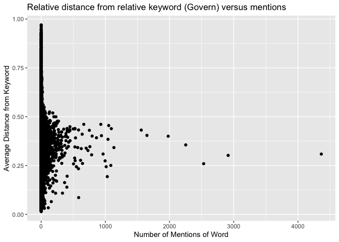
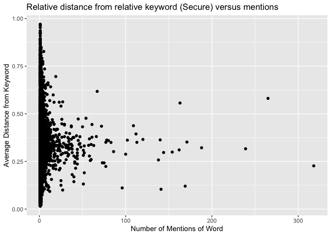
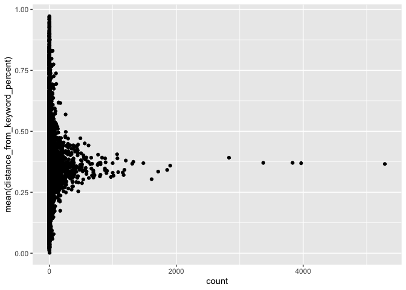
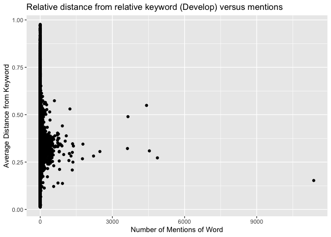

Global\_South\_Fall
================
Neeraj Sharma
11/3/2019

``` r
# Load in the df of all the speeches by speech
imported_files <- read_tsv(here::here("Data", "raw_speeches_mikhaylov_project.tsv"))

# Annotate the structure of the 1970s decade speeches. 
annotated_imported_files <- cnlp_annotate(imported_files %>% filter(Year %in% (1970:1979)), as_strings = TRUE)

# Get the individual words
all_words_only_1970 <- cnlp_get_token(annotated_imported_files) %>%
  filter(!str_detect(word, "^[0-9]*$")) %>%
  filter(!upos == "PUNCT" & !upos == "SPACE")

data(stop_words)
```

So I’ve been having some trouble applying this approach to get every
single word tagged for all 8093 speeches. Thus, at first, I’ve started
with the speeches in the 1970s only. That’s just under 5 million
individual words. I’d be at ~37 million when I annotate the entire
dataframe as it currently stands. That’ll take a long time to process so
I’ll do that later.

The words we are most interested at the moment are: \* Govern- \*
Develop- \* Secur-

and any relevant derivatives of them. These are words that we’ll tag the
entire sentence of when they appear in a speech.

Sentences where govern is discussed.

This is a function that finds out the distance between two words in a
string. It is my baby.

``` r
# Builds a function that counts how far apart two words are
distance_between_words <- function(df_of_all_tokens, keyword) {
  df <- df_of_all_tokens %>% 
    filter(lemma == keyword) %>%
    select(id, sid) %>%
    mutate(sentence_number = row_number()) %>%
    inner_join(all_words_only_1970, by = NULL) %>%
    select(id, sid, word, lemma, sentence_number)
  
  x <- max(select(df, sentence_number))
  
  datalist = list()
  for (i in 1:x) {
      # ... make some data
      limited_df <- filter(df, sentence_number == i)
      location_of_keyword <- limited_df %>%
          mutate(keyword_row_number = if_else(lemma == keyword, location <- as.double(row_number()), 0)) %>%
          filter(lemma == keyword) %>%
         select(sentence_number, keyword_row_number)
      
      final <- left_join(limited_df, location_of_keyword) %>%
        mutate(transient_row_number = as.double(row_number())) %>%
        mutate(length_of_sentence = max(transient_row_number)) %>%
        mutate(distance_from_keyword = abs(keyword_row_number - transient_row_number)) %>%
        mutate(distance_from_keyword_percent = distance_from_keyword/length_of_sentence)
      
      datalist[[i]] <- final # add it to your list
}
  export <- bind_rows(datalist)

  return(export)
}
```

Govern

``` r
distance_between_govern_other_words <- distance_between_words(all_words_only_1970, "govern") %>%
  select(id, sid, word, lemma, length_of_sentence, distance_from_keyword, distance_from_keyword_percent) %>%
  anti_join(stop_words) %>%
  group_by(lemma) %>%
  summarise(count = n(), mean(distance_from_keyword_percent)) %>%
  slice(27:n()) %>%
  arrange(-count) %>%
  filter(lemma != "govern")

ggplot(distance_between_govern_other_words, mapping = aes(`count`, `mean(distance_from_keyword_percent)`)) +
  geom_point()
```

<!-- -->

``` r
  # related words: scatter plot with count of total times said on x axis and distance from govern on y axis

# for some reason, the sentence division within the annotated_imported_files object is empty so cnlp_get_sentences returns an empty dataframe. What do I need to configure differently to get a) sentences to be parsed by the cnlp_annotate function up here and b) extract actual sentences and any information at that level.
```

Develop

``` r
distance_between_develop_other_words <- distance_between_words(all_words_only_1970, "develop") %>%
  select(id, sid, word, lemma, length_of_sentence, distance_from_keyword, distance_from_keyword_percent) %>%
  anti_join(stop_words) %>%
  group_by(lemma) %>%
  summarise(count = n(), mean(distance_from_keyword_percent)) %>%
  slice(215:n()) %>%
  arrange(-count) %>%
  filter(lemma != "develop")

ggplot(distance_between_develop_other_words, mapping = aes(`count`, `mean(distance_from_keyword_percent)`)) +
  geom_point()
```

<!-- -->

``` r
# that thing sitting all alone at 21 k is "country" unsurprisingly

ggplot(distance_between_develop_other_words %>% filter(lemma != "country"), mapping = aes(`count`, `mean(distance_from_keyword_percent)`)) +
  geom_point()
```

<!-- -->

Secure

``` r
distance_between_secure_other_words <- distance_between_words(all_words_only_1970, "secure") %>%
  select(id, sid, word, lemma, length_of_sentence, distance_from_keyword, distance_from_keyword_percent) %>%
  anti_join(stop_words) %>%
  group_by(lemma) %>%
  summarise(count = n(), mean(distance_from_keyword_percent)) %>%
  slice(24:n()) %>%
  arrange(-count) %>%
  filter(lemma != "secure")

ggplot(distance_between_secure_other_words, mapping = aes(`count`, `mean(distance_from_keyword_percent)`)) +
  geom_point()
```

<!-- -->
