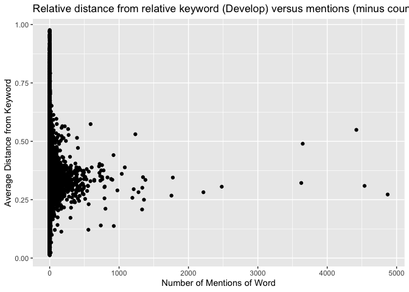
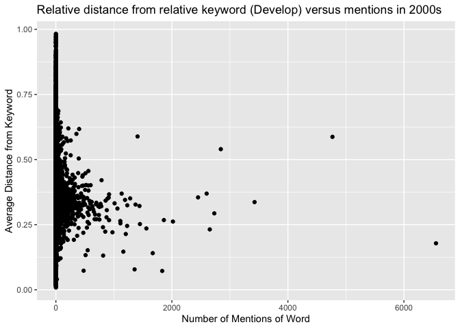
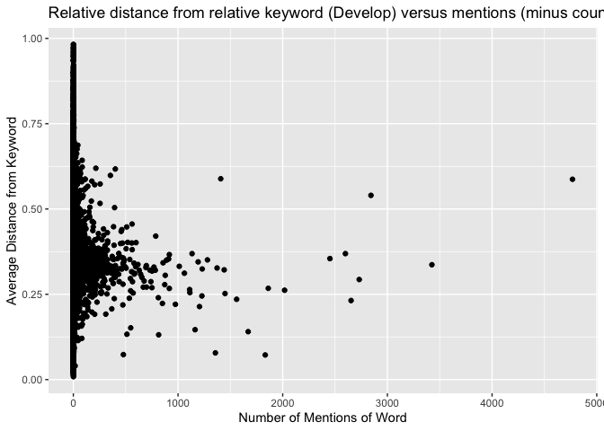

Global\_South\_Fall
================
Neeraj Sharma
11/3/2019

# Setup

Step 1 is to import the corpus that I previouslly annotated of every
UNGA speech. That was using corpusmaker.r. I store it on my desktop, and
a version can also be found on UChicago
box.

``` r
annotated_imported_speeches <- read_tsv("../../../../../Desktop/full_un_corpus_annotated.tsv") %>%
  filter(!str_detect(word, "^[0-9]*$")) %>%
  filter(!upos == "PUNCT" & !upos == "SPACE") %>%
  mutate(lemma = strip(lemma)) %>%
  # correcting lemmas of some weird special cases. 
  # One day I might wordStem the entire thing. 
  mutate(lemma = if_else(lemma == "development", "develop", lemma)) %>%
  mutate(lemma = if_else(lemma == "government", "govern", lemma)) %>%
  mutate(id = str_sub(id, end=-5)) %>%
  separate(id, c("Country", "Session", "Year"), sep = "_", remove = FALSE)
all_words_only <- annotated_imported_speeches
all_words_only_1970 <- all_words_only %>% filter(Year %in% (1970:1979))
all_words_only_2k <- all_words_only %>% filter(Year %in% (2000:2009))
```

# Function to determine the distance between words

This is a function that finds out the distance between two words in a
string. It is my baby. It’s important because my (read: Neeraj’s
possibly misinformed) hypothesis is that words relevant to a keyword
will be said closer in a sentence to the keyword itself. At minimum,
important words will be mentioned a lot.

``` r
# returns full tidytext df of sentences containing a specific keyword
sentences_with_keyword <- function(df, keyword) {
  returner <- df %>%
    filter(lemma == keyword) %>% 
    select(id, sid) %>% 
    distinct() %>% 
    left_join(df)
  return(returner)
}

# This grabs the sentence in front of, the sentence itself, and the sentence behind the keyword. 
local_sentences_with_keyword <- function(df, keyword) {
  sentence_ids <- df %>%
    filter(lemma == keyword) %>% 
    select(id, sid) %>% 
    distinct()
  all_ids_sids <- all_words_only %>% 
    select(id, sid) %>% 
    distinct() 
  #need to lag it to the sid before and lead it to the sid after. Can't just use +1 and -1 because of weirdness in how data got processed. 
  before_middle_after_sentence_ids <- bind_rows(sentence_ids, sentence_ids %>% mutate(sid = sid - 1), sentence_ids %>% mutate(sid = sid + 1)) %>%
    distinct() %>%
    arrange(id, sid)
  returner <- semi_join(df, before_middle_after_sentence_ids) %>%
    arrange(id, sid)
  return(returner)
}

# Builds a function that counts how far apart two words are.
# the df will almost allways be all_words_only
distance_between_words <- function(df, keyword) {
  sentence_length_of_all_sentences <- df %>%
    group_by(id, sid) %>%
    filter(row_number(tid) == n()) %>%
    select(id, sid, slength = tid)
  
  # This grabs all sentences with the keyword. It produces duplicates if the keyword appears multiple times. Those are removed later on.
  df_of_location_sentences_with_keyword <- df %>%
    filter(lemma == keyword) %>%
    select(id, sid) %>%
    mutate(sentence_number = row_number()) %>%
    unite(cat, c(id, sid), remove = FALSE) %>%
    mutate(is_duplicate = duplicated(cat)) %>%
    mutate(is_duplicate = if_else(is_duplicate == TRUE, TRUE, duplicated(cat, fromLast = TRUE))) %>%
    left_join(sentence_length_of_all_sentences)
  
  df_of_all_sentences_with_keyword <- inner_join(df, df_of_location_sentences_with_keyword) %>% select(id, sid, cat, tid, slength, word, lemma, sentence_number, is_duplicate)
  # # Begin distance_between_words
  sentences_containing_keyword <- df_of_all_sentences_with_keyword
  
  location_of_keywords_in_each_sentence <- sentences_containing_keyword %>%
    mutate(keyword_row_number = if_else(lemma == keyword, location <- tid, 0)) %>%
    filter(lemma == keyword) %>%
    select(sentence_number, keyword_row_number)
  export <- inner_join(sentences_containing_keyword, location_of_keywords_in_each_sentence, by = ("sentence_number")) %>%
    unite(cat, c(cat, tid), remove = FALSE) %>%
    mutate(distance_between_word_and_keyword = abs(keyword_row_number - tid)) %>%
    mutate(compare_value = if_else(is_duplicate, lead(distance_between_word_and_keyword), 0)) %>%
    distinct(cat, .keep_all = TRUE) %>%
    mutate(distance_between_word_and_keyword = if_else(is_duplicate, pmin(distance_between_word_and_keyword, compare_value), distance_between_word_and_keyword)) %>%
    mutate(distance_from_keyword_percent = distance_between_word_and_keyword/slength)
  return(export)
}
```

When we first started out in the Fall, we thought that the words we were
most interested in were:

  - Govern-
  - Develop-
  - Secur-

and any relevant derivatives of them. Those are words that I tagged when
they appeared in a speech. I need to update the next three sections of
code to reflect the current function that gets distances between words
and abilities to do the entire timespan of the corpus; not just 1970 to
1979.

# Mentions of Govern with related words form the 1970 to 1979 corpus

``` r
distance_between_govern_other_words <- distance_between_words(all_words_only_1970, "govern") %>%
  select(id, sid, word, lemma, slength, distance_between_word_and_keyword, distance_from_keyword_percent) %>%
  anti_join(stop_words) %>%
  group_by(lemma) %>%
  summarise(count = n(), mean(distance_from_keyword_percent)) %>%
  slice(27:n()) %>%
  arrange(-count) %>%
  filter(lemma != "govern")

ggplot(distance_between_govern_other_words, mapping = aes(`count`, `mean(distance_from_keyword_percent)`)) +
  geom_point() +
  labs(x = "Number of Mentions of Word", y = "Average Distance from Keyword", title = "Relative distance from relative keyword (Govern) versus mentions")
```

<!-- -->

``` r
# related words: scatter plot with count of total times said on x axis and distance from govern on y axis

# for some reason, the sentence division within the annotated_imported_files object is empty so cnlp_get_sentences returns an empty dataframe. What do I need to configure differently to get a) sentences to be parsed by the cnlp_annotate function up here and b) extract actual sentences and any information at that level.

kable(distance_between_govern_other_words %>% slice(1:15))
```

| lemma         | count | mean(distance\_from\_keyword\_percent) |
| :------------ | ----: | -------------------------------------: |
| pron          |  4364 |                              0.3088577 |
| people        |  2913 |                              0.3020368 |
| the           |  2531 |                              0.2594704 |
| united        |  2252 |                              0.3557453 |
| country       |  1979 |                              0.4001479 |
| international |  1648 |                              0.4043956 |
| nations       |  1559 |                              0.4315169 |
| states        |  1133 |                              0.3420868 |
| world         |  1093 |                              0.4387548 |
| republic      |  1085 |                              0.2507780 |
| develop       |  1052 |                              0.4548922 |
| assembly      |  1041 |                              0.3841942 |
| state         |  1030 |                              0.1934079 |
| south         |  1013 |                              0.2441387 |
| support       |   996 |                              0.2740290 |

# Mentions of Secure with related words form the 1970 to 1979 corpus

``` r
distance_between_secure_other_words <- distance_between_words(all_words_only_1970, "secure") %>%
  select(id, sid, word, lemma, slength, distance_between_word_and_keyword, distance_from_keyword_percent) %>%
  anti_join(stop_words) %>%
  group_by(lemma) %>%
  summarise(count = n(), mean(distance_from_keyword_percent)) %>%
  slice(24:n()) %>%
  arrange(-count) %>%
  filter(lemma != "secure")

ggplot(distance_between_secure_other_words, mapping = aes(`count`, `mean(distance_from_keyword_percent)`)) +
  geom_point() +
  labs(x = "Number of Mentions of Word", y = "Average Distance from Keyword", title = "Relative distance from relative keyword (Secure) versus mentions")
```

<!-- -->

``` r
kable(distance_between_secure_other_words %>% slice(1:15))
```

| lemma         | count | mean(distance\_from\_keyword\_percent) |
| :------------ | ----: | -------------------------------------: |
| peace         |   318 |                              0.2269418 |
| pron          |   265 |                              0.5809695 |
| people        |   239 |                              0.3166736 |
| world         |   188 |                              0.3218985 |
| country       |   171 |                              0.3519784 |
| recognize     |   169 |                              0.1203065 |
| the           |   163 |                              0.5567938 |
| international |   162 |                              0.3105630 |
| israel        |   154 |                              0.2991619 |
| states        |   144 |                              0.2968760 |
| boundary      |   141 |                              0.1040082 |
| united        |   140 |                              0.3632544 |
| right         |   138 |                              0.2578147 |
| nations       |   120 |                              0.3655365 |
| develop       |   113 |                              0.3503016 |

# Mentions of Develop with related words form the 1970 to 1979 corpus

``` r
distance_between_develop_other_words <- distance_between_words(all_words_only_1970, "develop") %>%
  select(id, sid, word, lemma, slength, distance_between_word_and_keyword, distance_from_keyword_percent) %>%
  anti_join(stop_words) %>%
  group_by(lemma) %>%
  summarise(count = n(), mean(distance_from_keyword_percent)) %>%
  slice(215:n()) %>%
  arrange(-count) %>%
  filter(lemma != "develop")

ggplot(distance_between_develop_other_words, mapping = aes(`count`, `mean(distance_from_keyword_percent)`)) +
  geom_point() +
  labs(x = "Number of Mentions of Word", y = "Average Distance from Keyword", title = "Relative distance from relative keyword (Develop) versus mentions")
```

<!-- -->

``` r
# that thing sitting all alone at 21 k is "country" unsurprisingly

ggplot(distance_between_develop_other_words %>% filter(lemma != "country"), mapping = aes(`count`, `mean(distance_from_keyword_percent)`)) +
  geom_point() +
  labs(x = "Number of Mentions of Word", y = "Average Distance from Keyword", title = "Relative distance from relative keyword (Develop) versus mentions (minus country)")
```

<!-- -->

``` r
kable(distance_between_develop_other_words %>% slice(1:15))
```

| lemma         | count | mean(distance\_from\_keyword\_percent) |
| :------------ | ----: | -------------------------------------: |
| country       | 11370 |                              0.1529402 |
| economic      |  4871 |                              0.2723424 |
| international |  4538 |                              0.3092513 |
| pron          |  4420 |                              0.5490999 |
| the           |  3647 |                              0.4897497 |
| world         |  3626 |                              0.3216598 |
| united        |  2480 |                              0.3057610 |
| nations       |  2216 |                              0.2819746 |
| people        |  1775 |                              0.3448721 |
| operation     |  1755 |                              0.2675153 |
| states        |  1380 |                              0.3348484 |
| nation        |  1359 |                              0.2497759 |
| peace         |  1345 |                              0.3465467 |
| resource      |  1335 |                              0.3011712 |
| social        |  1332 |                              0.2080895 |

We had previously only looked at 1970 to 1979. Develop is super meaty,
so we’ll try to do some analysis on stuff way after 1979. We should
expect to see some significant differences in the language of say, the
2000s compared to the language of the 1970s.

Lets get an annotated corpus over 2000 to 2009.

ITS GONE NOW AND HAS MOVED WAY UP TO THE START SETUP

Now lets look at develop and compare it to 1970s stuff. Especially in
the context of a specific nation, say
Indonesia.

``` r
distance_between_develop_other_words_2k <- distance_between_words(all_words_only_2k, "develop") %>%
  select(id, sid, word, lemma, slength, distance_between_word_and_keyword, distance_from_keyword_percent) %>%
  anti_join(stop_words) %>%
  group_by(lemma) %>%
  summarise(count = n(), mean(distance_from_keyword_percent)) %>%
  slice(87:n()) %>%
  arrange(-count) %>%
  filter(lemma != "develop")

ggplot(distance_between_develop_other_words_2k, mapping = aes(`count`, `mean(distance_from_keyword_percent)`)) +
  geom_point() +
  labs(x = "Number of Mentions of Word", y = "Average Distance from Keyword", title = "Relative distance from relative keyword (Develop) versus mentions in 2000s")
```

<!-- -->

``` r
# that thing sitting all alone at 8.8 k is "country" unsurprisingly

ggplot(distance_between_develop_other_words_2k %>% filter(lemma != "country"), mapping = aes(`count`, `mean(distance_from_keyword_percent)`)) +
  geom_point() +
  labs(x = "Number of Mentions of Word", y = "Average Distance from Keyword", title = "Relative distance from relative keyword (Develop) versus mentions (minus country) in 2000s")
```

<!-- -->

``` r
kable(distance_between_develop_other_words_2k %>% slice(1:15))
```

| lemma         | count | mean(distance\_from\_keyword\_percent) |
| :------------ | ----: | -------------------------------------: |
| country       |  6553 |                              0.1784306 |
| pron          |  4768 |                              0.5871054 |
| international |  3425 |                              0.3366388 |
| the           |  2843 |                              0.5399266 |
| world         |  2731 |                              0.2933059 |
| economic      |  2653 |                              0.2317195 |
| united        |  2599 |                              0.3692089 |
| nations       |  2451 |                              0.3546518 |
| peace         |  2018 |                              0.2618614 |
| security      |  1862 |                              0.2675499 |
| sustainable   |  1833 |                              0.0722118 |
| millennium    |  1670 |                              0.1405439 |
| human         |  1560 |                              0.2354107 |
| states        |  1449 |                              0.2521979 |
| global        |  1441 |                              0.3216451 |

# TFIDF

The most recent breakthrough has been on TFIDF.

``` r
#List of countries for filtering
country_filter <- str_to_lower(pull(codelist, country.name.en)) 

# I DONT WANT TO STEM RIGHT NOW. THAT MEANS RIGHT AND RIGHTS ARE DIFFERENT THINGS
# Brute force adds stemming but this is kinda unnecessary because lemma works well enough, at least so far.
#all_words_only <- all_words_only %>%
#  mutate(word_stem = wordStem(lemma))

# Takes in a df of the words that appear in a sentence containing a keyword and returns a df of words that appear within a certain range of years. 
# Common ranges of years: a decade, each year, five years. 
# Example question this function answers: What were the most important words to govern in a 5 year period?
tfidfer <- function(df, start_year, up_to) {
  tfidf_over_range <- df %>%
    filter(Year %in% seq(start_year, start_year + up_to)) %>%
    bind_tf_idf(lemma, id, n) %>%
    filter(lemma %in% country_filter == FALSE) %>%
    anti_join(stop_words, by = c("lemma" = "word"))
  return(tfidf_over_range)
}

# Function that gets the top tfidf words in each year. This is applied to a dataframe that already has done tfidf analyis on a bunch of words related to a keyword over a period of time.
# The keyword technically does not matter for this function. 
tfidf_aux_word_organizer <- function(df_of_tfidf_of_every_individual_word) {
  df_of_tfidf_of_every_individual_word <- df_of_tfidf_of_every_individual_word %>% 
    separate(id, c("Country", "Session", "Year")) %>%
    group_by(Year, lemma) %>%
    summarize(mean_tfidf = mean(tf_idf), n = n()) %>%
    filter(n >= 5) %>%
    ungroup() %>%
    mutate(ratio = mean_tfidf/n) %>%
    arrange(desc(ratio)) %>%
    filter(lemma != "develop" 
           & lemma != "pron" 
           & lemma != "people" 
           & lemma != ""
           & lemma != "country"
           & lemma != "countries"
           & lemma != ""
           & lemma != "united"
           & lemma != "nation"
           & lemma != "nations"
           & lemma != "international"
           & lemma != "'s") %>% group_by(Year) %>% top_n(n = 10) 
  return(df_of_tfidf_of_every_individual_word)
}

printer_producer <- function(dataframe) {
  dataframe <- dataframe %>% 
    arrange(-desc(Year))
  data <- list()
  for (i in seq(as.double(min(dataframe$Year)), as.double(max(dataframe$Year)))) {
    data <- bind_cols(data, dataframe %>% filter(Year == i))
  }
  return(data)
}
```

## TFIDF for stuff related to govern.

Single sentence.

``` r
# note that this produces an unstemmed all_words_only. 
sentences_mention_govern <- sentences_with_keyword(all_words_only, "govern")
num_words_in_each_speech_mentioning_govern <- sentences_mention_govern %>% 
  count(id, lemma) %>% 
  group_by(id) %>%
  summarize(`words in speech` = sum(n))

mentions_of_aux_words_in_sentences_containing_govern <- left_join(sentences_mention_govern %>% count(id, lemma), num_words_in_each_speech_mentioning_govern) %>%
  separate(id, c("Country", "Session", "Year"), remove = FALSE)

# tfidfer(mentions_of_aux_words_in_sentences_containing_govern, 1970, 9) %>% select(-Year, -Session, -Country) is equal to govern_full_tfidf_1970_ided
# furthermore, all of the govern_xxxxs equals the previous govern_full_tfidf_xxxx_yeared I previously had. Thus, it is the proper implimentation. 
govern_1970s <- tfidf_aux_word_organizer(tfidfer(mentions_of_aux_words_in_sentences_containing_govern, 1970, 9) %>% select(-Year, -Session, -Country))
govern_1980s <- tfidf_aux_word_organizer(tfidfer(mentions_of_aux_words_in_sentences_containing_govern, 1980, 9) %>% select(-Year, -Session, -Country))
govern_1990s <- tfidf_aux_word_organizer(tfidfer(mentions_of_aux_words_in_sentences_containing_govern, 1990, 9) %>% select(-Year, -Session, -Country))
govern_2000s <- tfidf_aux_word_organizer(tfidfer(mentions_of_aux_words_in_sentences_containing_govern, 2000, 9) %>% select(-Year, -Session, -Country))
govern_2010s <- tfidf_aux_word_organizer(tfidfer(mentions_of_aux_words_in_sentences_containing_govern, 2010, 9) %>% select(-Year, -Session, -Country))

#View(bind_rows(printer_producer(govern_1970s), printer_producer(govern_1980s), printer_producer(govern_1990s), printer_producer(govern_2000s), printer_producer(govern_2010s)))
```

Local Sentences
included.

``` r
local_sentences_mention_govern <- local_sentences_with_keyword(all_words_only, "govern")

num_words_insentences_locally_mentioning_govern <- local_sentences_mention_govern %>% 
  count(id, lemma) %>% 
  group_by(id) %>%
  summarize(`words in speech` = sum(n))

mentions_of_aux_words_in_localsentences_containing_govern <- left_join(local_sentences_mention_govern %>% count(id, lemma), num_words_insentences_locally_mentioning_govern) %>%
  separate(id, c("Country", "Session", "Year"), remove = FALSE)

extended_govern_1970s <- tfidf_aux_word_organizer(tfidfer(mentions_of_aux_words_in_localsentences_containing_govern, 1970, 9) %>% select(-Year, -Session, -Country))
extended_govern_1980s <- tfidf_aux_word_organizer(tfidfer(mentions_of_aux_words_in_localsentences_containing_govern, 1980, 9) %>% select(-Year, -Session, -Country))
extended_govern_1990s <- tfidf_aux_word_organizer(tfidfer(mentions_of_aux_words_in_localsentences_containing_govern, 1990, 9) %>% select(-Year, -Session, -Country))
extended_govern_2000s <- tfidf_aux_word_organizer(tfidfer(mentions_of_aux_words_in_localsentences_containing_govern, 2000, 9) %>% select(-Year, -Session, -Country))
extended_govern_2010s <- tfidf_aux_word_organizer(tfidfer(mentions_of_aux_words_in_localsentences_containing_govern, 2010, 9) %>% select(-Year, -Session, -Country))

#View(bind_rows(printer_producer(extended_govern_1970s), printer_producer(extended_govern_1980s), printer_producer(extended_govern_1990s), printer_producer(extended_govern_2000s), printer_producer(extended_govern_2010s)))
```

## TFIDF for stuff related to Develop

Single sentence.

``` r
# note that this produces an unstemmed all_words_only. 
sentences_mention_develop <- sentences_with_keyword(all_words_only, "develop")
num_words_in_each_speech_mentioning_develop <- sentences_mention_develop %>% 
  count(id, lemma) %>% 
  group_by(id) %>% 
  summarize(`words in speech` = sum(n))

mentions_of_aux_words_in_sentences_containing_develop <- left_join(sentences_mention_develop %>% count(id, lemma), num_words_in_each_speech_mentioning_develop) %>%
  separate(id, c("Country", "Session", "Year"), remove = FALSE)

develop_1970s <- tfidf_aux_word_organizer(tfidfer(mentions_of_aux_words_in_sentences_containing_develop, 1970, 9) %>% select(-Year, -Session, -Country))
develop_1980s <- tfidf_aux_word_organizer(tfidfer(mentions_of_aux_words_in_sentences_containing_develop, 1980, 9) %>% select(-Year, -Session, -Country))
develop_1990s <- tfidf_aux_word_organizer(tfidfer(mentions_of_aux_words_in_sentences_containing_develop, 1990, 9) %>% select(-Year, -Session, -Country))
develop_2000s <- tfidf_aux_word_organizer(tfidfer(mentions_of_aux_words_in_sentences_containing_develop, 2000, 9) %>% select(-Year, -Session, -Country))
develop_2010s <- tfidf_aux_word_organizer(tfidfer(mentions_of_aux_words_in_sentences_containing_develop, 2010, 9) %>% select(-Year, -Session, -Country))

#View(bind_rows(printer_producer(develop_1970s %>% filter(lemma != "lucia")), printer_producer(develop_1980s), printer_producer(develop_1990s), printer_producer(develop_2000s),printer_producer(develop_2010s)))
```

Local sentences
included.

``` r
local_sentences_mention_develop <- local_sentences_with_keyword(all_words_only, "develop")

num_words_insentences_locally_mentioning_develop <- local_sentences_mention_develop %>% 
  count(id, lemma) %>% 
  group_by(id) %>%
  summarize(`words in speech` = sum(n))

mentions_of_aux_words_in_localsentences_containing_develop <- left_join(local_sentences_mention_develop %>% count(id, lemma), num_words_insentences_locally_mentioning_develop) %>%
  separate(id, c("Country", "Session", "Year"), remove = FALSE)

extended_develop_1970s <- tfidf_aux_word_organizer(tfidfer(mentions_of_aux_words_in_localsentences_containing_develop, 1970, 9) %>% select(-Year, -Session, -Country))
extended_develop_1980s <- tfidf_aux_word_organizer(tfidfer(mentions_of_aux_words_in_localsentences_containing_develop, 1980, 9) %>% select(-Year, -Session, -Country))
extended_develop_1990s <- tfidf_aux_word_organizer(tfidfer(mentions_of_aux_words_in_localsentences_containing_develop, 1990, 9) %>% select(-Year, -Session, -Country))
extended_develop_2000s <- tfidf_aux_word_organizer(tfidfer(mentions_of_aux_words_in_localsentences_containing_develop, 2000, 9) %>% select(-Year, -Session, -Country))
extended_develop_2010s <- tfidf_aux_word_organizer(tfidfer(mentions_of_aux_words_in_localsentences_containing_develop, 2010, 9) %>% select(-Year, -Session, -Country))

#View(bind_rows(printer_producer(extended_develop_1970s), printer_producer(extended_develop_1980s), printer_producer(extended_develop_1990s), printer_producer(extended_develop_2000s), printer_producer(extended_develop_2010s)))
```

## TFIDF for stuff related to Rights

Single sentence.

``` r
# "rights" gets lemma'ed to "right"
# "Rights" gets lemma'ed to "rights." I do some overriding to get them to be the same in this context.
sentences_mention_right <- sentences_with_keyword(all_words_only %>% mutate(lemma = if_else(lemma == "rights", "right", lemma)), "right")
num_words_in_each_speech_mentioning_right <- sentences_mention_right %>%  
  count(id, lemma) %>% 
  group_by(id) %>% 
  summarize(`words in speech` = sum(n))

mentions_of_aux_words_in_sentences_containing_right <- left_join(sentences_mention_right %>% count(id, lemma), num_words_in_each_speech_mentioning_right) %>%
  separate(id, c("Country", "Session", "Year"), remove = FALSE)

right_1970s <- tfidf_aux_word_organizer(tfidfer(mentions_of_aux_words_in_sentences_containing_right, 1970, 9) %>% select(-Year, -Session, -Country))
right_1980s <- tfidf_aux_word_organizer(tfidfer(mentions_of_aux_words_in_sentences_containing_right, 1980, 9) %>% select(-Year, -Session, -Country))
right_1990s <- tfidf_aux_word_organizer(tfidfer(mentions_of_aux_words_in_sentences_containing_right, 1990, 9) %>% select(-Year, -Session, -Country))
right_2000s <- tfidf_aux_word_organizer(tfidfer(mentions_of_aux_words_in_sentences_containing_right, 2000, 9) %>% select(-Year, -Session, -Country))
right_2010s <- tfidf_aux_word_organizer(tfidfer(mentions_of_aux_words_in_sentences_containing_right, 2010, 9) %>% select(-Year, -Session, -Country))

#View(bind_rows(printer_producer(right_1970s), printer_producer(right_1980s), printer_producer(right_1990s), printer_producer(right_2000s),printer_producer(right_2010s)))
```

Local sentences
included.

``` r
local_sentences_mention_right <- local_sentences_with_keyword(all_words_only %>% mutate(lemma = if_else(lemma == "rights", "right", lemma)), "right")

num_words_insentences_locally_mentioning_right <- local_sentences_mention_right %>% 
  count(id, lemma) %>% 
  group_by(id) %>%
  summarize(`words in speech` = sum(n))

mentions_of_aux_words_in_localsentences_containing_right <- left_join(local_sentences_mention_right %>% count(id, lemma), num_words_insentences_locally_mentioning_right) %>%
  separate(id, c("Country", "Session", "Year"), remove = FALSE)

extended_right_1970s <- tfidf_aux_word_organizer(tfidfer(mentions_of_aux_words_in_localsentences_containing_right, 1970, 9) %>% select(-Year, -Session, -Country))
extended_right_1980s <- tfidf_aux_word_organizer(tfidfer(mentions_of_aux_words_in_localsentences_containing_right, 1980, 9) %>% select(-Year, -Session, -Country))
extended_right_1990s <- tfidf_aux_word_organizer(tfidfer(mentions_of_aux_words_in_localsentences_containing_right, 1990, 9) %>% select(-Year, -Session, -Country))
extended_right_2000s <- tfidf_aux_word_organizer(tfidfer(mentions_of_aux_words_in_localsentences_containing_right, 2000, 9) %>% select(-Year, -Session, -Country))
extended_right_2010s <- tfidf_aux_word_organizer(tfidfer(mentions_of_aux_words_in_localsentences_containing_right, 2010, 9) %>% select(-Year, -Session, -Country))

#View(bind_rows(printer_producer(extended_right_1970s), printer_producer(extended_right_1980s), printer_producer(extended_right_1990s), printer_producer(extended_right_2000s), printer_producer(extended_right_2010s)))
```

## TFIDF for stuff related to capability

Relevant Words: \* capability, mentioned 1674 times \* capable,
mentioned 1933 times \* capacity, mentioned 5748 times \* ability,
mentioned 3239 times. I do not include this in my calculation however.

in comparison: \* right, mentioned 48186 times \* develop, mentioned
113759 times \* govern, 47939

I found this out by running the following code and simply filtering
using the command f
function.

``` r
# View(all_words_only %>% count(lemma) %>% arrange(desc(n)) %>% anti_join(stop_words, by = c("lemma" = "word")))
```

To check in the future. Look at these for just one sentence. Lemmas: \*
responsibility, mentions 14k \* dialogue, 11k \* **sustainable , 11k**
\* **solidarity, 8k** \* **resilience + resilient + resiliency
combined.**

Single
sentence.

``` r
sentences_mention_capability <- sentences_with_keyword(all_words_only %>% mutate(lemma = if_else(lemma == "capable", "capability", lemma)) %>% mutate(lemma = if_else(lemma == "capacity", "capability", lemma)), "capability")
num_words_in_each_speech_mentioning_capability <- sentences_mention_capability %>%  
  count(id, lemma) %>% 
  group_by(id) %>% 
  summarize(`words in speech` = sum(n))

mentions_of_aux_words_in_sentences_containing_capability <- left_join(sentences_mention_capability %>% count(id, lemma), num_words_in_each_speech_mentioning_capability) %>%
  separate(id, c("Country", "Session", "Year"), remove = FALSE)

capability_1970s <- tfidf_aux_word_organizer(tfidfer(mentions_of_aux_words_in_sentences_containing_capability, 1970, 9) %>% select(-Year, -Session, -Country))
capability_1980s <- tfidf_aux_word_organizer(tfidfer(mentions_of_aux_words_in_sentences_containing_capability, 1980, 9) %>% select(-Year, -Session, -Country))
capability_1990s <- tfidf_aux_word_organizer(tfidfer(mentions_of_aux_words_in_sentences_containing_capability, 1990, 9) %>% select(-Year, -Session, -Country))
capability_2000s <- tfidf_aux_word_organizer(tfidfer(mentions_of_aux_words_in_sentences_containing_capability, 2000, 9) %>% select(-Year, -Session, -Country))
capability_2010s <- tfidf_aux_word_organizer(tfidfer(mentions_of_aux_words_in_sentences_containing_capability, 2010, 9) %>% select(-Year, -Session, -Country))

#View(bind_rows(printer_producer(capability_1970s), printer_producer(capability_1980s), printer_producer(capability_1990s), printer_producer(capability_2000s),printer_producer(capability_2010s)))
```

Local sentences
included.

``` r
local_sentences_mention_capability <- local_sentences_with_keyword(all_words_only %>% mutate(lemma = if_else(lemma == "capable", "capability", lemma)) %>% mutate(lemma = if_else(lemma == "capacity", "capability", lemma)), "capability")

num_words_insentences_locally_mentioning_capability <- local_sentences_mention_capability %>% 
  count(id, lemma) %>% 
  group_by(id) %>%
  summarize(`words in speech` = sum(n))

mentions_of_aux_words_in_localsentences_containing_capability <- left_join(local_sentences_mention_capability %>% count(id, lemma), num_words_insentences_locally_mentioning_capability) %>%
  separate(id, c("Country", "Session", "Year"), remove = FALSE)

extended_capability_1970s <- tfidf_aux_word_organizer(tfidfer(mentions_of_aux_words_in_localsentences_containing_capability, 1970, 9) %>% select(-Year, -Session, -Country))
extended_capability_1980s <- tfidf_aux_word_organizer(tfidfer(mentions_of_aux_words_in_localsentences_containing_capability, 1980, 9) %>% select(-Year, -Session, -Country))
extended_capability_1990s <- tfidf_aux_word_organizer(tfidfer(mentions_of_aux_words_in_localsentences_containing_capability, 1990, 9) %>% select(-Year, -Session, -Country))
extended_capability_2000s <- tfidf_aux_word_organizer(tfidfer(mentions_of_aux_words_in_localsentences_containing_capability, 2000, 9) %>% select(-Year, -Session, -Country))
extended_capability_2010s <- tfidf_aux_word_organizer(tfidfer(mentions_of_aux_words_in_localsentences_containing_capability, 2010, 9) %>% select(-Year, -Session, -Country))

#View(bind_rows(printer_producer(extended_capability_1970s), printer_producer(extended_capability_1980s), printer_producer(extended_capability_1990s), printer_producer(extended_capability_2000s), printer_producer(extended_capability_2010s)))
```

Feb 5 2020 We need to think about extra sentences as going farther out
in terms of accuracy of the valance key words. Single sentence gives us
the core language surrounding the keyword. If you were to argue the
greater sentences, you’d argue that they are less convincing but still
substantive.

Govern, capability are working capability is the only one that had
really useful insight on extra sentences.

Development is working alright in showing a difference.

Rights didnt work well for us period. It’s not helpful.

The single sentence was fundamental and core. The extended sentences
will function as a helper context.

rerun the big chunk above for rights and capibailities adjust the words
from funciton to look at sentence before and after especially for
govern\_1970s
